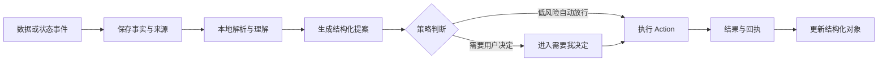
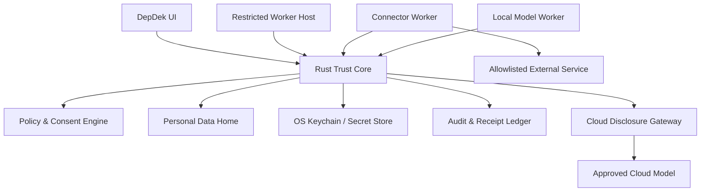

# DepDek 2.0 概念设计：本地个人数据操作系统

> 状态：产品方向基线草案
> 日期：2026-08-09
> 产品阶段：V0.2 之后的目标形态
> 核心承诺：我的数据在本地，我的 Agent 为我工作，我对每次外部行动拥有最终决定权。

## 1. 重新定义 DepDek

DepDek 不是传统个人工作台，也不是以 Chat 为中心的 Agent 客户端。

DepDek 是一个 **local-first Personal Data OS（本地个人数据操作系统）**：它将分散在文件、图片、视频、邮件、日历、订单、行程和互联网平台中的个人数据带回本地，保留原始来源，归一为可检索、可关联、可迁移的个人对象；Agent 在这些对象上持续工作，提出可审查的建议，并在用户策略允许的范围内执行操作。

产品的核心不是“用户与 Agent 聊了多少次”，而是：

1. 用户是否真正持有自己的数据；
2. 数据是否能够跨来源形成可信的个人上下文；
3. Agent 是否可靠地发现、推进并闭环用户的承诺；
4. 用户是否能看见 Agent 读取了什么、判断了什么、准备做什么以及实际做了什么；
5. 用户是否能在不依赖某个平台或某个模型的情况下迁移自己的数据和工作方式。

## 2. 两个核心产品矛盾

### 2.1 结构化界面与 Agent 驱动

邮件、日历、订单、文件等数据需要稳定、可浏览、可批量处理的结构化界面；复杂目标和跨数据源任务又需要 Agent 的理解与规划能力。

DepDek 不在“传统界面”和“Chat 界面”之间二选一，而采用双层设计：

- **结构化界面保存事实、状态和操作结果**；
- **Agent 负责监听变化、理解上下文、生成提案和执行获批行动**；
- **Chat 只负责跨对象查询、复杂规划和修订提案，不成为业务状态的唯一载体**。

任何对话指令都必须最终转化为一种可持久化的结构化结果：`Query`、`Proposal`、`Action`、`Task`、`Rule` 或 `MemoryCandidate`。关闭 Chat 后，工作状态不能丢失。

### 2.2 本地数据主权与外部服务连接

DepDek 需要从外部平台取回用户数据，但不能依赖获取密码、复制 Cookie、破解私有数据库或绕过平台权限。

产品采用“连接方式分级”而不是承诺所有平台实时同步：

1. 官方 OAuth / API；
2. 官方个人数据下载包；
3. 邮件、账单、票据和通知导入；
4. 用户在场的官方导出助手；
5. 手动上传开放文件。

平台是否支持实时 API 只影响新鲜度，不影响用户在 DepDek 中拥有统一对象、来源和长期历史。

## 3. 产品原则

### 3.1 数据优先于模型

模型是可替换的处理器，用户数据、对象关系、策略和回执才是 DepDek 的长期资产。

### 3.2 结构化状态优先于聊天历史

聊天可以发起任务，但不能成为订单状态、任务状态、同步状态或审批状态的唯一记录。

### 3.3 Agent 原生，但不是 Agent 表演

Agent 应通过持续处理结果体现价值，而不是依靠头像、角色卡或大量拟人化对话体现存在感。

### 3.4 事实、推断、建议、行动严格分层

- **Fact**：来自本地原始数据或可信远端来源；
- **Inference**：模型或规则产生的判断，带置信度和依据；
- **Proposal**：等待用户确认的结构化建议；
- **Action**：已授权、可执行、可审计的操作；
- **Receipt**：执行或外发后的不可混淆结果。

### 3.5 来源永远可达

任务、订单、日程、摘要、关系和记忆都必须能够回到原始邮件、文件、数据包或远端记录。

### 3.6 读取优先，写回后置

首期连接器优先取回、归一和检索数据。发送、删除、修改、购买、支付等远端写操作必须逐步开放，并采用更高等级审批。

### 3.7 本地不是一句品牌口号

本地优先必须由技术边界证明：Secret Store、网络目的地白名单、最小 capability、外发预览、审计和离线模式缺一不可。

## 4. 核心产品对象

### 4.1 Personal Data Home

用户持有的本地数据家园，包含：

- 原始对象和导入快照；
- 归一记录和实体关系；
- 全文、向量和媒体索引；
- Agent 提案、任务、行动和结果；
- 记忆候选与已确认记忆；
- 同步、外发和外部执行回执；
- 策略、迁移清单和备份元数据。

凭据不属于 Home，数据库只保存 `credential_ref`。

### 4.2 Canonical Object

DepDek 2.0 的首要对象包括：

- `Person`：个人、联系人、参与者；
- `Organization`：公司、商户、平台、学校等；
- `Message`：邮件、聊天、通知；
- `Event`：会议、行程、截止日期、时间块；
- `Task`：待办、承诺、等待事项；
- `Document`：文档、网页、附件、笔记；
- `Media`：图片、视频、音频；
- `Order`：商品、服务、外卖、酒店、机票订单；
- `Trip`：航班、酒店、车票和行程组合；
- `Transaction`：支付、退款、发票和账单；
- `Project`：目标、主题和长期工作单元；
- `MemoryFact`：带来源、置信度和有效期的个人记忆。

归一对象不覆盖原始数据，而是建立带 `source_ref` 和 `provenance` 的投影。

### 4.3 Agent Proposal

Agent 对数据作出的结构化建议，例如：

- 将邮件识别为订单；
- 从通知中提取截止日期；
- 将行程加入日历；
- 将承诺加入待办；
- 合并重复联系人；
- 推荐归档或删除一组邮件；
- 形成周计划或项目下一步。

Proposal 必须包含依据、置信度、影响对象、建议变化、风险等级和可选审批范围。

### 4.4 Action

Action 是可执行操作，至少包含：

- 发起者与责任 Agent；
- 输入数据范围及版本；
- 目标和执行计划；
- 本地或远端能力；
- 风险等级；
- 所需审批；
- 幂等键；
- 当前状态；
- 执行结果与回滚信息。

### 4.5 Receipt

以下行为都需要 Receipt：

- 同步或导入；
- 调用云端模型；
- 读取敏感对象；
- 使用凭据；
- 远端发送、删除或修改；
- 规则自动放行的操作。

## 5. Agent 工作模型

### 5.1 事件驱动

所有数据变化形成领域事件，例如：

- `message.received`
- `order.imported`
- `event.updated`
- `file.added`
- `sync.failed`
- `task.overdue`
- `approval.granted`

Agent 通过订阅事件工作，而不是等待用户打开对话。

### 5.2 标准处理链

### 5.3 Agent Team 的角色

Agent Team 是系统配置能力，不应成为用户每天必须维护的组织结构。

每个 Agent 配置：

- 角色与目标；
- 可订阅事件；
- 可读取的数据域；
- 可调用的能力；
- 本地/云端模型策略；
- 自动放行上限；
- 输出对象类型；
- 失败和升级策略。

用户主要通过对象页面、决策队列和执行记录感知 Agent，而不是通过角色聊天列表感知 Agent。

## 6. UX 架构

### 6.1 一级导航

建议将导航按“用户需要处理的状态”和“用户拥有的数据”分组。

#### 工作

- 需要我决定
- 正在执行
- 今天
- 待办

#### 我的数据

- 收件箱
- 日历
- 订单与行程
- 文件与媒体
- 人物与项目

#### 系统

- 连接
- Agent 与自动化
- 记忆
- 活动与回执
- 数据与隐私
- 设置

### 6.2 首页

首页从通用 Dashboard 转为 Agent Operations 首页，优先展示：

1. 需要用户作出的决定；
2. Agent 正在执行的任务；
3. 今日时间与承诺；
4. 新取回的数据及 Agent 处理结果；
5. 最近完成的行动和回执；
6. 连接、存储、本地模型和备份健康状态。

### 6.3 领域页面

邮箱、日历、订单、文件保留行业成熟的信息架构，同时增加统一的 Agent 层：

- 行内处理状态；
- 对象级建议；
- 批处理提案；
- “加入待办/项目/行程”等跨对象动作；
- 来源、同步时间和敏感级别；
- 右侧上下文 Agent 抽屉。

### 6.4 Chat

Chat 入口保留，但定位为“指令与协商层”：

- 查询跨来源事实；
- 创建复杂任务；
- 解释或修改 Proposal；
- 规划需要多个 Agent 协作的目标；
- 查看行动依据和失败原因。

Chat 中必须明确区分：事实、推断、草稿、等待批准和已执行。

## 7. 外部数据连接模型

### 7.1 连接方式分级

| 等级 | 方式 | 特性 | 产品承诺 |
|---|---|---|---|
| A | 官方 OAuth/API | 可增量、可撤权、部分支持写回 | 实时或准实时同步 |
| B | 官方个人数据下载包 | 覆盖广但有生成等待和格式变化 | 导入、校验、重导 |
| C | 邮件/账单/票据 | 稳定、可追溯、字段不完全 | 自动识别订单和行程 |
| D | 用户在场的导出助手 | 用户完成登录和官方导出 | 引导、监控下载、导入 |
| E | 手动上传 | 通用、即时、更新依赖用户 | 本地解析与来源标记 |

### 7.2 平台策略

- 微信：官方备份/迁移文件、账单、收藏文件、用户主动导出和权利申请；不读取私有数据库，不接管账号登录。
- 抖音：优先个人信息下载包；开放平台 OAuth 用于已开放且获批的用户数据范围。
- 美团：个人信息下载包、订单页导出、票据和通知邮件。
- 携程：订单确认邮件、行程单、电子票、发票、ICS、官方复制请求和后续可能的合作接口。

连接页面应诚实区分“实时连接”“数据包导入”“票据聚合”，避免使用同一个绿色在线状态掩盖能力差异。

## 8. 本地隐私架构

强制边界：

- Rust Core 是数据、凭据、网络、模型外发和外部行动的唯一授权边界；
- Worker 不能直接读取任意文件、钥匙串或访问任意网络；
- Credential Broker 只向特定连接器操作提供短期 capability，不返回可展示明文；
- 云端模型调用前生成外发数据包，展示字段、敏感度、用途、模型和保留策略；
- Restricted 数据默认禁止外发；
- 断网时结构化浏览、搜索、本地处理和已下载数据继续可用。

## 9. 产品边界

DepDek 2.0 首期不承诺：

- 绕过平台限制抓取所有个人数据；
- 为用户保管平台明文密码或长期 Cookie；
- 自动付款、交易、医疗或法律决定；
- 将所有私人数据发送给云端模型；
- 用单一 Chat 窗口替代成熟的邮箱、日历和文件体验；
- 允许 Agent 直接使用任意 shell、文件系统或网络；
- 归一化后丢弃原始来源。

## 10. 北极星指标

**每周由 DepDek 可靠闭环的个人承诺数。**

一次可靠闭环包括：从原始来源发现或由用户创建，形成结构化 Task/Action，经确认或符合策略自动执行，完成后保留来源与结果回执。

辅助指标：

- 每周新增可追溯个人对象数；
- Agent 提案确认率、修改率和忽略率；
- 从数据进入到提案生成的中位时间；
- 本地完成率与云端升级率；
- 外部行动审批后成功率；
- 连接器健康率和增量同步成功率；
- 凭据、敏感数据和未授权外发事件数，目标始终为 0。

## 11. 从当前工程迁移

当前 Rust Vault、append-only audit、NDJSON RPC、受限 sidecar、Tauri/React 桌面壳和本地模型接入可以保留。

需要优先演进：

1. 文件目录升级为 Personal Data Home 与 Canonical Object Store；
2. 普通配置文件中的凭据迁移到 OS Keychain；
3. 邮件特例升级为统一 Connector / Importer 模型；
4. 当前任务框架升级为持久 Action / Job / Receipt；
5. Copilot Chat 升级为结构化 Proposal 和 Action 的发起与修订入口；
6. Today 卡片工作台升级为决策、执行和结果驱动首页；
7. 新增 Order、Trip、Transaction 等个人生活对象。

任何跨 Rust、sidecar、React 的接口变化，都必须先同步更新 `docs/contract.md`，再分别实现和测试三层。
