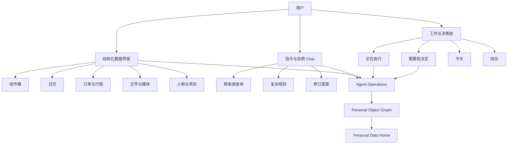
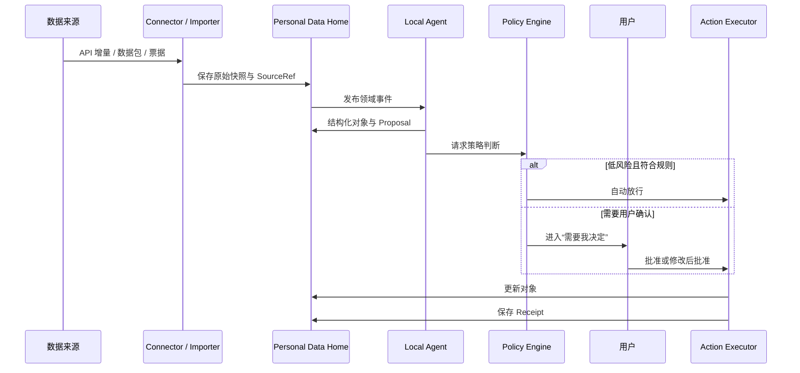
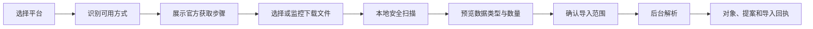
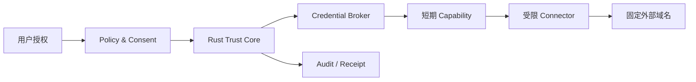
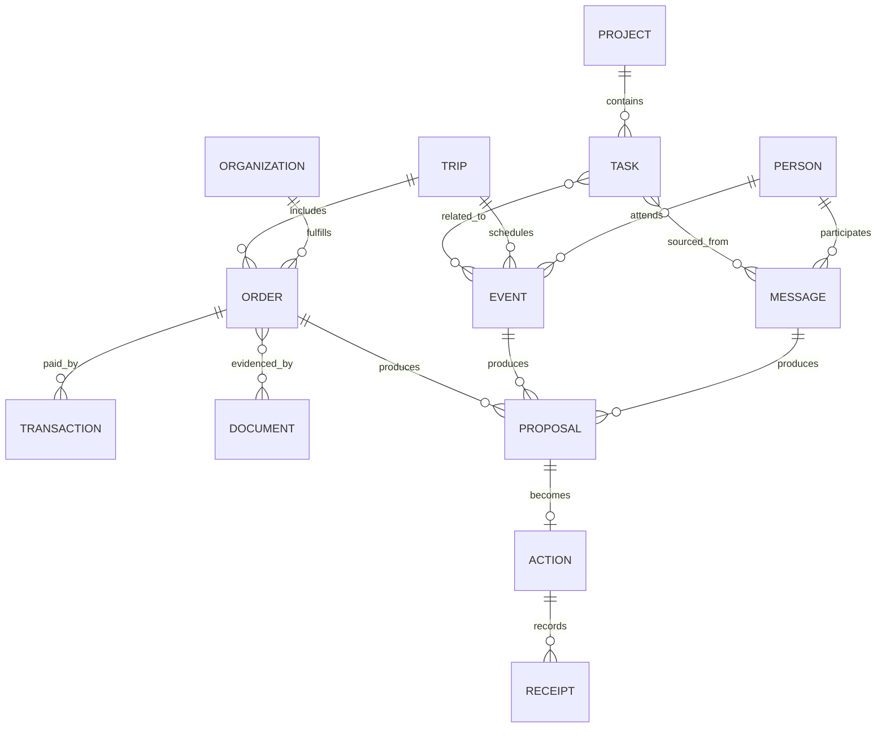

# DepDek 2.0 信息架构与设计板说明

> 用途：Figma 信息架构板内容源
> 日期：2026-08-09
> 依据：`DepDek 2.0 Concept.md`、`DepDek 2.0 PRD.md`

## Board 0：产品命题

### 标题

**DepDek 2.0 — Local Personal Data OS**

### 核心承诺

我的数据在本地；Agent 持续为我工作；任何外发与外部行动都可见、可控、可追溯。

### 三个产品支柱

1. **Own**：从文件、邮件、日历和互联网平台取回属于自己的数据。
2. **Understand**：在本地归一、检索、关联并形成可治理的长期记忆。
3. **Act**：Agent 监听数据变化、提出行动、在策略内执行并保存回执。

### 三项明确否定

- 不是把第三方服务入口堆在一个桌面上；
- 不是依赖 Chat 保存所有工作状态；
- 不是通过保存平台密码和爬取私有接口获得数据。

## Board 1：产品分层



### 设计决策

- 结构化页面是事实和状态的长期载体；
- Agent Operations 是系统持续工作的主循环；
- Chat 是临时入口，输出必须落为结构化对象；
- Personal Data Home 是用户真正持有的资产。

## Board 2：一级导航

```text
DepDek
├── 工作
│   ├── 需要我决定        [Proposal / Approval / Conflict / Memory]
│   ├── 正在执行          [Sync / Import / Parse / Model / Action]
│   ├── 今天              [时间 / 承诺 / 异常 / 最近完成]
│   └── 待办              [待办 / 马上办 / 进行中 / 已办完]
├── 我的数据
│   ├── 收件箱            [邮件 / 消息 / 通知]
│   ├── 日历              [事件 / 截止日期 / 时间块]
│   ├── 订单与行程        [订单 / 交易 / 交通 / 住宿]
│   ├── 文件与媒体        [文档 / 图片 / 视频 / 音频]
│   └── 人物与项目        [关系 / 主题 / 承诺 / 进展]
└── 系统
    ├── 连接              [API / 数据包 / 票据 / 手动导入]
    ├── Agent 与自动化    [订阅 / 角色 / 权限 / 策略]
    ├── 记忆              [待确认 / 已确认 / 过期 / 删除]
    ├── 活动与回执        [读取 / 同步 / 外发 / 写回]
    ├── 数据与隐私        [存储 / 备份 / 导出 / 删除]
    └── 设置              [模型 / 外观 / 快捷键]
```

### 全局顶部栏

- 搜索与指令；
- 快速创建；
- 当前后台任务；
- 本地/云端模型状态；
- 上下文 Agent；
- 离线和异常状态。

## Board 3：首页布局

### 页面目标

让用户在 10 秒内知道：什么需要决定、系统正在做什么、今天必须完成什么、最近完成了什么。

```text
┌─────────────────────────────────────────────────────────────────┐
│ 时间 / 问候       搜索、导航、创建、提问        新建  任务  Agent │
├───────────────────────────────┬─────────────────────────────────┤
│ 需要我决定                    │ 正在执行                        │
│ · 3 个行动项                  │ · 美团数据包解析 68%            │
│ · 1 个行程合并                │ · 邮件整理 320 / 642            │
│ · 2 条记忆候选                │ · 文件索引 1,240 项             │
├───────────────────────────────┼─────────────────────────────────┤
│ 今天的时间线                  │ 今天的承诺                      │
│ 日历 + 行程 + 截止日期        │ 待办 + 邮件行动项 + 等待事项    │
├───────────────────────────────┴─────────────────────────────────┤
│ 最近完成                                                       │
│ 归档邮件 / 创建行程 / 更新任务 / 查看完整回执                   │
├─────────────────────────────────────────────────────────────────┤
│ 数据健康：连接 · 本地模型 · 存储 · 备份（正常时保持紧凑）       │
└─────────────────────────────────────────────────────────────────┘
```

### 优先级规则

1. 等待决定的高风险行动；
2. 失败或等待输入的后台任务；
3. 今日时间冲突和即将到期承诺；
4. Agent 新发现的数据关系；
5. 系统健康信息。

## Board 4：Agent 操作闭环



### Proposal 卡片结构

```text
[风险等级] [责任 Agent] [置信度]
建议：将这封邮件识别为“上海出差订单”

依据
· 携程订单确认邮件
· 航班 MUxxxx，8 月 12 日
· 酒店入住 8 月 12—14 日

准备产生的变化
· 新建 Trip
· 新建 2 个 Event
· 新建 1 个 Task：报销

[查看来源] [修改] [拒绝] [批准]
```

## Board 5：结构化页面与 Agent 层

### 邮箱

```text
邮件列表状态：未处理 / Agent 处理中 / 有建议 / 已整理 / 失败
对象动作：加入待办 / 关联项目 / 识别订单 / 归档建议 / 删除建议
右侧详情：原文 + 来源 + 提取对象 + Proposal + 上下文 Chat
```

### 日历

```text
事件状态：本地 / 已同步 / 待写回 / 冲突 / 连接失败
对象动作：加入待办 / 关联行程 / 请求改期 / 查找冲突
Agent 层：准备时间、行程时间、承诺冲突、空闲块建议
```

### 订单与行程

```text
订单列表：平台 / 商户 / 金额 / 状态 / 时间 / 来源
行程视图：交通 + 酒店 + 会议 + 文件 + 待办
Agent 层：合并重复订单、提醒退款、提取报销、写入日历
```

### 文件与媒体

```text
左侧：文件夹与类型
中间：虚拟化列表/网格
右侧：预览、元数据、来源、关联对象、版本
Agent 层：分类、OCR、人物/项目关联、敏感信息、重复文件
```

## Board 6：连接中心

### 连接卡信息

```text
美团                                         [数据包导入]
账号：用户自主导出
数据：订单、地址、交易、评价
方向：只读
最近导入：2026-08-08  ·  1,284 条
新鲜度：需要重新申请数据包
权限：本地解析；禁止云端外发
原始数据：Home/objects/imports/...

[重新导入] [查看日志] [权限与策略] [删除]
```

### 连接方式视觉语言

| 标签 | 含义 | 新鲜度表达 |
|---|---|---|
| 实时 API | 官方授权和增量同步 | 在线 / 延迟时间 |
| 数据包导入 | 官方个人信息下载文件 | 数据包日期 |
| 票据聚合 | 邮件、PDF、ICS、账单 | 最近识别时间 |
| 导出助手 | 用户在场完成官方流程 | 等待用户操作 |
| 手动上传 | 用户选择本地文件 | 文件导入时间 |

### 数据取回向导



## Board 7：隐私与信任

### 权限链



### 云端模型外发 Sheet

```text
为什么需要云端模型
本地模型无法稳定完成多约束周计划比较。

准备发送
✓ 匿名化任务标题 12 条
✓ 时间约束 8 条
✓ 项目优先级 3 条
✕ 邮件原文
✕ 联系人真实姓名
✕ 凭据和账号信息

模型：用户选择的 Provider / Model
策略：仅本次

[取消] [仅本地继续] [批准发送]
```

## Board 8：对象关系



### 来源原则

- 一个归一对象可以有多个 SourceRef；
- 一个原始记录可以产生多个派生对象；
- 派生对象必须记录模型/规则版本；
- 合并、拆分和删除均生成 provenance；
- 原始来源与索引分离，索引可重建。

## Board 9：版本路线

```text
V0.3  Personal Object Foundation
      对象、来源、Proposal、需要我决定、Today 重构
        ↓
V0.4  Trust & Connection Center 2.0
      Keychain、Credential Broker、导入框架、权限中心
        ↓
V0.5  Agent Operations
      事件、Job、订阅、Action、Approval、Receipt
        ↓
V0.6  Personal Data Intake Packs
      美团、抖音、携程、微信合法导入与跨来源合并
```

### 关键依赖

- V0.3 先统一对象，否则连接器会继续制造孤立文件；
- V0.4 先解决凭据和网络边界，再新增在线连接；
- V0.5 建立可恢复、可审计的 Agent 主循环；
- V0.6 扩充平台覆盖并验证 Order/Trip 场景。

## Figma 画板规格

- 页面：`DepDek 2.0 Product Architecture`
- Frame 宽度：1440 px
- 背景：沿用当前 DepDek 的浅灰紫色桌面背景
- 卡片：白色/半透明，16—24 px 圆角，细紫灰描边
- 主色：沿用当前紫色品牌色，用于 Agent、Action 和选中状态
- 状态色：绿色=完成，黄色=等待决定，蓝色=执行中，红色=失败/高风险
- 字体：沿用系统中文无衬线字体
- 图标：沿用当前工程图标库，不新增手绘图标体系
- 每个 Board 使用一致标题条和一句“设计决策”摘要
- Board 0—9 纵向排列，Board 2/4/6/7/8 作为核心评审区
