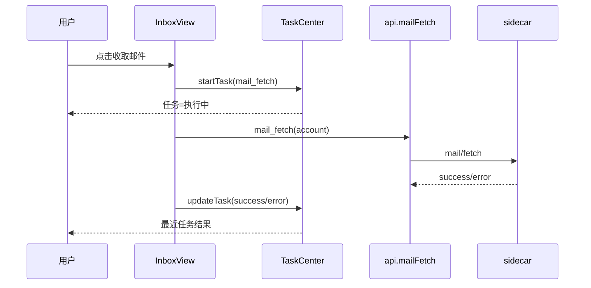
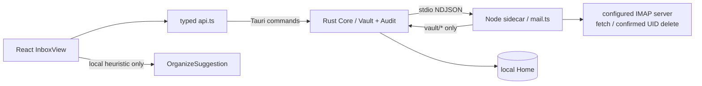
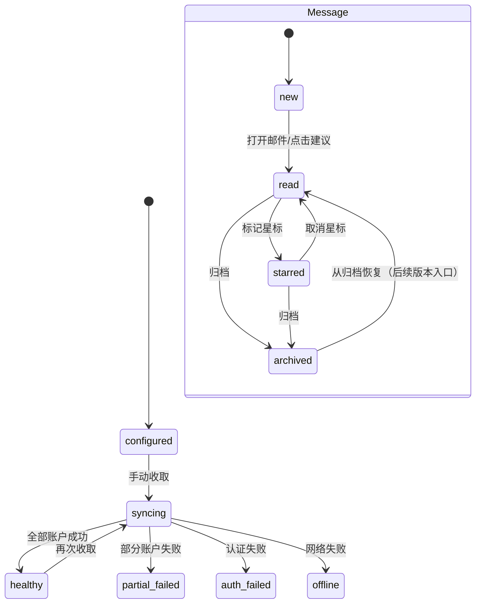

# DepDek V0.2 系统设计：本地优先收件箱与邮箱连接基础版

> 设计范围：V0.2 / Sprint 1
>
> 上游：[V0.2 PRD](<V0.2 PRD.md>)
>
> 契约基线：`docs/contract.md` v1
>
> 设计结论：本 Sprint 复用现有 Vault/RPC，并补充受保护的 `mail_delete` 和统一 TodoBus；邮件/日历保留来源事实，待办队列只保存可回溯的处理投影。

## 1.1 统一任务执行框架

任务框架位于 React 产品壳层，负责统一呈现所有长耗时操作；它不是新的网络服务，也不改变 Rust/sidecar 契约。

```ts
type TaskRecord = {
  id: string;
  kind: "mail_fetch" | "mail_delete" | "file_index" | "calendar_sync" | "model_run" | "other";
  title: string;
  detail: string;
  status: "running" | "success" | "error";
  startedAt: number;
  finishedAt?: number;
  message?: string;
  progress?: { current: number; total?: number; label?: string };
  logs: Array<{ ts: number; level: "info" | "success" | "warn" | "error"; message: string }>;
};
```

生命周期：`startTask(input) → running → updateTask(id, progress/log) → success|error`。任务中心保留最近 50 条记录，并将完整任务日志备份到 Vault 的 `tasks/history.json`；列表只显示最近 4 条，点击任务打开完整日志。应用重启后未完成任务会标记为“上次会话未完成”，V0.3+ 再迁移为可恢复的后台队列。批处理任务按步骤追加日志。



## 1. 架构与信任边界



- Rust Core 是唯一的路径沙箱、审计和本地文件信任边界；React 不直接访问文件系统。
- sidecar 不获得 fs/bash 工具，只能通过 `vault/*` RPC 读写配置和邮件副本；stdout 只输出协议行，日志输出 stderr。
- 邮件网络只连接用户在账户配置里声明的 IMAP 主机；V0.2 不连接云端模型。远端删除必须由前端二次确认后以 UIDPLUS 安全定位执行。
- AI 整理在前端对已加载的标题、发件人、摘要和正文片段做规则化建议；凭据不进入输入，也不触发 RPC。

## 2. 数据设计

### 2.1 账户配置（兼容 contract §7）

路径：`mail/accounts.json`。唯一键为 `name`，名称不得为空、不得包含 `/` 或 `..`。

```ts
type MailAccountsFile = { accounts: MailAccount[] };

type MailAccount = {
  name: string;          // 同时是本地目录名
  host: string;          // IMAP host
  port?: number;         // 1..65535，默认 993
  secure?: boolean;      // 默认 true
  user: string;          // 邮箱地址
  password: string;      // V0.2 兼容债务；V0.4 替换为 CredentialRef
  mailbox?: string;      // 默认 INBOX
  last_uid?: number;     // sidecar 维护的增量游标
};
```

V0.2 的实现保持现有 schema，避免破坏 sidecar 和旧 Home。前端表单使用 `type=password`，列表、AI、日志均不渲染 password。

### 2.2 原始邮件副本

路径：`mail/<account>/<epoch_ms>-<uid>.md`。内容由 `sidecar/src/mail.ts::renderMessageMarkdown` 生成，头部包含 Subject/From/To/Date/UID/附件名，分隔线后的内容用标记同时保存 HTML 和 text/plain 正文。

原始 Markdown 是唯一事实来源。列表读取目录后通过 `vault_read_file` 解析头部，不从邮件 HTML 执行脚本，不在 V0.2 保存附件二进制。

### 2.3 本地处理状态索引

路径：`mail/index.json`。它不是 Canonical 主库，缺失或损坏时可丢弃；原始邮件仍可读。

```ts
type MailIndexFile = {
  version: 1;
  updated_at: string; // ISO 8601
  messages: Record<string, {
    read?: boolean;
    starred?: boolean;
    archived?: boolean;
  }>;
};
```

`messageId` 使用原始文件相对路径，保证同一账户同 UID 的兼容路径可定位；跨账户不会冲突。索引不包含密码、不替代 `last_uid`。V0.3 迁移为 `Message.flags` 与 `SourceRef` 后仍可从此索引回放。

### 2.4 状态机



sidecar 只有在单封邮件成功写入 Vault 后才推进 `last_uid`；单账户失败只写结果项，不能阻断其它账户。

### 2.5 日历中枢数据

`calendar/accounts.json` 保存连接元数据，`calendar/events.json` 保存本地聚合后的事件事实。外部事件以 `source_account_id + remote_id` 去重；本地新建事件没有远端 ID，只有在用户显式选择写回后才获得外部标识。

```ts
type CalendarEvent = {
  id: string;
  remote_id?: string;
  source_account_id?: string;
  source_name?: string;
  title: string;
  start: string;
  end: string;
  all_day?: boolean;
  location?: string;
  description?: string;
};
```

### 2.6 统一待办队列

`todo/queue.json` 是处理层的规范化队列，不覆盖邮件 Markdown 或日历事件事实。消息由 sidecar `TodoBus` 归一化后持久化，前端通过 `todo://event` 增量刷新。

```ts
type TodoLane = "backlog" | "now" | "blocked" | "done";
type TodoPriority = "important_urgent" | "important_not_urgent" | "urgent_not_important" | "other";
type TodoItem = {
  id: string; title: string; description?: string; lane: TodoLane; priority: TodoPriority;
  source: { type: "manual"|"mail"|"calendar"|"agent"|"external"; id?: string; label?: string; path?: string; remoteId?: string };
  dueAt?: string; createdAt: string; updatedAt: string; tags?: string[]; dedupeKey?: string;
  hooks?: Array<{ name: string; status: "pending"|"running"|"success"|"error"; message?: string }>;
};
```

四泳道分别表达处理状态：“待办”表示已确认但未安排，“马上办”表示当前专注，“等待中”表示依赖外部条件，“已办完”表示闭环。重要/紧急矩阵独立于泳道，作为排序和筛选维度。`TodoBus.subscribe(name, hook)` 负责调用处理钩子，发布者不直接依赖订阅者。

## 3. 模块设计

### 3.1 React 前端

| 模块 | 文件 | 职责 |
|---|---|---|
| Inbox 路由 | `src/components/DepDekHome.tsx` | 将 `view=inbox` 路由到 InboxView，保留 Home/Deep Work |
| Inbox 页面 | `src/components/InboxView.tsx` | 账户状态、账户选择、文件夹、邮件列表/阅读、多选删除确认、本地/远端删除、状态索引、AI 面板 |
| Calendar 页面 | `src/components/CalendarView.tsx` | 月视图、账户筛选、日程 agenda、连接账户、本地新建、显式外部写回 |
| 待办面板 | `src/components/TodoBoard.tsx` | 四泳道、优先级筛选、拖放/下拉移动、手动入队和来源展示 |
| 待办存储 | `src/todoStore.ts` / `src/todoTypes.ts` | Tauri 队列 API、浏览器预览 localStorage、事件订阅和共享类型 |
| 任务模型 | `src/taskTypes.ts` | TaskRecord、任务类型、生命周期更新类型和跨模块 reporter |
| 任务中心 | `src/components/DepDekHome.tsx` | Today 顶部“任务”入口、批处理自动打开、执行中/最近任务面板、进度和日志展示 |
| Inbox 样式 | `src/components/inbox.css` | 三栏邮箱布局、空态、错误态、账户弹窗、响应式 |
| Tauri API | `src/api.ts` | typed `vaultReadFile`、`vaultWriteFile`、`vaultListDir`、`vaultDeleteFile`、`mailFetch`、`mailDelete` |
| Deep Work 菜单 | `src/components/SideMenu.tsx` | 移除重复的“我的邮件”树，避免两套入口 |

浏览器模式用 fixture 账户和邮件；Tauri 模式只通过 API 访问 Vault。所有异步操作都显示 loading/notice，异常不让页面白屏。

### 3.2 Rust Core

通过 `todo_list`、`todo_enqueue`、`todo_update` 转发统一队列请求；不改 Vault 安全逻辑。继续保证：相对路径、symlink、文件大小、UTF-8、审计记录都在 Rust 侧校验。

### 3.3 Node sidecar

复用 `sidecar/src/mail.ts`：读取 `mail/accounts.json`、按 `last_uid` 增量 fetch、用 `simpleParser` 生成 Markdown、经 `vault/write_file` 落盘、回写游标；在确认后的 `mail/delete` 中使用 UIDPLUS 执行目标删除。sidecar 不读写 `mail/index.json`，因为该文件是 UI 处理状态。`sidecar/src/todo.ts` 提供 `todo/list`、`todo/enqueue`、`todo/update` 和 `TodoBus`；队列读写走 `vault/*`，通知走 `todo/event`，hook 由订阅者回调执行。

## 4. 接口设计

### 4.1 前端 → Rust Tauri commands

| 调用 | 参数 | 用途 | 审计 session |
|---|---|---|---|
| `vault_read_file` | `{path}` | 读 `mail/accounts.json`、`mail/index.json` 和邮件 Markdown | `user` |
| `vault_write_file` | `{path, content}` | 保存账户配置与处理状态 | `user` |
| `vault_list_dir` | `{path}` | 列出 `mail/<account>` 下的 Markdown | `user` |
| `vault_delete_file` | `{path}` | 删除用户确认后的本地邮件 Markdown | `user` |
| `mail_fetch` | `{account?, refreshBody?}` | 请求 sidecar 执行 IMAP 增量收取/正文修复 | sidecar 内部为 `mail` |
| `mail_delete` | `{account, uids}` | 用户确认后请求 sidecar 按 UID 删除远端邮件 | sidecar 内部为 `mail` |
| `calendar_sync` | `{account?}` | 从已配置 endpoint 导入事件到本地中枢 | sidecar 内部为 `calendar` |
| `calendar_push` | `{account, event}` | 用户明确勾选后写回 CalDAV | sidecar 内部为 `calendar` |
| `todo_list` | — | 读取规范化待办队列 | sidecar 内部为 `todo` |
| `todo_enqueue` | `{input}` | 发布邮件/日历/外部消息并持久化 | sidecar 内部为 `todo` |
| `todo_update` | `{input}` | 移动泳道、调整优先级或编辑待办 | sidecar 内部为 `todo` |

以上接口已经存在于 `docs/contract.md` v1；V0.2 不得只改一层。如果未来增加 `mail/index` 专用 RPC，必须先更新契约、Rust、sidecar 和 `api.ts`，本 Sprint 不做。

### 4.2 Rust ↔ sidecar

`mail_fetch` 转发为 sidecar `mail/fetch`，结果为：

```ts
type MailFetchResult = {
  fetched: number;
  accounts: Array<{
    name: string;
    new_messages: number;
    error?: string;
  }>;
};
```

sidecar 的 Vault RPC 统一带 `session_id: "mail"`。单账号错误在 `accounts[i].error`，不抛掉其它账户结果；无配置或未知账户使用 contract 定义的 `-32002`。

`mail/delete` 只接受正整数 UID，sidecar 连接并锁定目标 mailbox 后检查 `UIDPLUS`，再按输入顺序逐个调用 `messageDelete([uid], {uid: true})`，前一个 Promise 完成后才发送下一个。缺少 UIDPLUS、连接失败或远端未确认时返回错误，不应清理本地副本。

日历 sidecar 以 ICS/CalDAV 作为跨服务的最小共同协议：`calendar/sync` 解析 VEVENT 并合并本地事件；Apple/iCloud 使用 `caldav.icloud.com` 时先通过 Basic Auth + 应用专用密码执行 PROPFIND 发现 principal/calendar-home，再用 REPORT 拉取日历数据；`webcal://` 公开订阅自动转为 HTTPS；`calendar/push` 只对可写 CalDAV 发起 PUT。Google、Microsoft 和 Apple 的 OAuth connector 保留统一账户模型，V0.2 仍按读取优先处理，不伪装成可写。

收取邮件不在应用启动阶段执行。只有用户点击“收取邮件”才创建 `mail_fetch` 任务并调用 sidecar；sidecar 通过 `mail/event` 按连接、读取、保存、完成/失败阶段上报，Rust 转发为 `mail://event`。连接和打开文件夹各有 30 秒超时，任务不会无限停留在 running。

### 4.3 本地 AI 接口（非 RPC）

```ts
type OrganizeSuggestion = {
  id: string;
  kind: "action" | "deadline" | "archive";
  sourceMessageId: string;
  title: string;
  reason: string;
  confidence?: number;
};
```

V0.2 只在 React 内生成建议，输入是已加载邮件的非凭据字段；建议不可直接执行外部写操作。V0.7 才将该能力移动到本地模型与 DerivedRecord 管道。

### 4.4 任务层接口（React 内部）

```ts
type TaskReporter = {
  onStartTask?: (task: TaskStartInput) => string;
  onUpdateTask?: (id: string, update: TaskUpdate) => void;
};
```

`InboxView` 在调用 `mailFetch`、批量删除本地/远端邮件前登记任务，在每个步骤追加进度和日志，在成功/失败分支更新任务；批量远端删除仍按 UID 串行发送。删除确认完成后弹窗立即关闭，任务在后台执行，任务中心由任务启动时自动打开；点击任务可以查看 `tasks/history.json` 中的完整日志。未来文件索引、日历同步和模型运行只需复用 reporter，不再为每个模块单独设计顶部状态入口。Today 顶部快捷栏只由 `activeView === "today"` 渲染。

`CalendarView` 在同步账户、导入事件和显式写回时复用同一 reporter；事件先写本地，再将外部写回作为独立任务，失败不会回滚本地日程。

## 5. 错误与恢复设计

| 来源 | 分类 | UI 行为 |
|---|---|---|
| Vault root 未设置 | `E32004` | 引导用户先设置 Home，不重试网络 |
| 文件/账户不存在 | `E32002` | 显示空态与添加账户 CTA |
| 路径越界/大小/编码 | `E32001/E32003/E32005` | 显示本地存储错误，保留已有列表 |
| IMAP 认证失败 | per-account `error` | 提示重新检查授权码，不自动重试 |
| IMAP 网络失败 | per-account `error` | 提示重试，离线仍可阅读本地缓存 |
| Markdown 解析失败 | 本地读取错误 | 跳过坏文件并提示，不阻断其它邮件 |
| `mail/index.json` 损坏 | 派生索引错误 | 清空 flags，原始邮件继续可读，后续操作重建 |
| 远端不支持 UIDPLUS | 受保护的删除错误 | 保留本地邮件，提示无法安全同步删除；用户仍可选择仅删除本地 |

## 6. 安全、迁移与回滚

- 所有路径仍由 Rust Vault 校验；sidecar 禁止直接 fs/bash；每次 Vault 成功或失败都有审计。
- 删除操作必须经过确认弹窗。默认“仅删除本地”只删除 Vault 内当前邮件副本和对应索引 flags，不调用 IMAP；只有用户主动选择“同步删除远端”时，才通过 `mail_delete` 使用 UIDPLUS 的 UID EXPUNGE 定位删除。
- 远端删除成功后才清理本地副本；远端失败或能力不足时本地副本保留，避免形成“远端已删但用户看不到失败原因”的静默破坏。
- V0.2 接受 `accounts.json.password` 明文债务，但不能把它复制到 `mail/index.json`、AI prompt、日志或 UI 文本；V0.4 迁移前不得宣称“凭据保险库完成”。
- `mail/index.json` 是派生数据，删除它只会丢失已读/星标/归档 flags，不会删除原始邮件；回滚只需删除索引并回到 V0.1 mail bridge。
- V0.3 导入时按原始相对路径建立 `SourceRef`，迁移必须可重复、可回滚，并保留原始 Markdown。

## 7. 测试设计映射

- Rust Core：沿用 Vault 路径越界、symlink、大小、UTF-8、审计测试；
- sidecar：沿用无配置、UID 幂等、单账户失败、Markdown header、危险账户名测试；
- React：构建 + 浏览器回归覆盖账户、列表/阅读、状态索引、AI 本地声明、Deep Work 去重；
- 发布：Tauri app codesign 与 DMG integrity；没有 Apple notarization 时不阻塞本地构建，但必须在发布记录标注。
