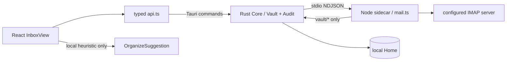
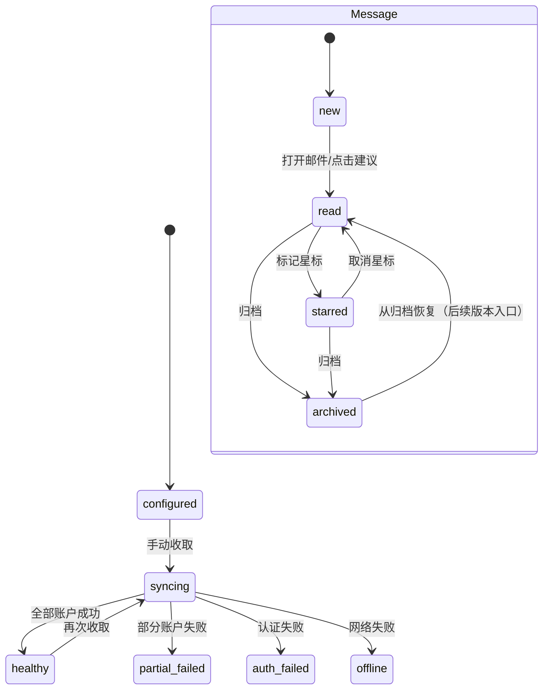

# DepDek V0.2 系统设计：本地优先收件箱与邮箱连接基础版

> 设计范围：V0.2 / Sprint 1
>
> 上游：[V0.2 PRD](<V0.2 PRD.md>)
>
> 契约基线：`docs/contract.md` v1
>
> 设计结论：本 Sprint 复用现有 Vault/RPC/`mail_fetch`，不新增跨层 RPC；邮件原始 Markdown 是事实来源，`mail/index.json` 是可删除、可重建的 UI 状态索引。

## 1. 架构与信任边界



- Rust Core 是唯一的路径沙箱、审计和本地文件信任边界；React 不直接访问文件系统。
- sidecar 不获得 fs/bash 工具，只能通过 `vault/*` RPC 读写配置和邮件副本；stdout 只输出协议行，日志输出 stderr。
- 邮件网络只连接用户在账户配置里声明的 IMAP 主机；V0.2 不连接云端模型。
- AI 整理在前端对已加载的标题、发件人、摘要和正文片段做规则化建议；凭据不进入输入，也不触发 RPC。

## 2. 数据设计

### 2.1 账户配置（兼容 contract §7）

路径：`mail/accounts.json`。唯一键为 `name`，名称不得为空、不得包含 `/` 或 `..`。

```ts
type MailAccountsFile = { accounts: MailAccount[] };

type MailAccount = {
  name: string;          // 同时是本地目录名
  host: string;          // IMAP host
  port?: number;         // 1..65535，默认 993
  secure?: boolean;      // 默认 true
  user: string;          // 邮箱地址
  password: string;      // V0.2 兼容债务；V0.4 替换为 CredentialRef
  mailbox?: string;      // 默认 INBOX
  last_uid?: number;     // sidecar 维护的增量游标
};
```

V0.2 的实现保持现有 schema，避免破坏 sidecar 和旧 Home。前端表单使用 `type=password`，列表、AI、日志均不渲染 password。

### 2.2 原始邮件副本

路径：`mail/<account>/<epoch_ms>-<uid>.md`。内容由 `sidecar/src/mail.ts::renderMessageMarkdown` 生成，头部包含 Subject/From/To/Date/附件名，分隔线后的内容是 text/plain 正文。

原始 Markdown 是唯一事实来源。列表读取目录后通过 `vault_read_file` 解析头部，不从邮件 HTML 执行脚本，不在 V0.2 保存附件二进制。

### 2.3 本地处理状态索引

路径：`mail/index.json`。它不是 Canonical 主库，缺失或损坏时可丢弃；原始邮件仍可读。

```ts
type MailIndexFile = {
  version: 1;
  updated_at: string; // ISO 8601
  messages: Record<string, {
    read?: boolean;
    starred?: boolean;
    archived?: boolean;
  }>;
};
```

`messageId` 使用原始文件相对路径，保证同一账户同 UID 的兼容路径可定位；跨账户不会冲突。索引不包含密码、不替代 `last_uid`。V0.3 迁移为 `Message.flags` 与 `SourceRef` 后仍可从此索引回放。

### 2.4 状态机



sidecar 只有在单封邮件成功写入 Vault 后才推进 `last_uid`；单账户失败只写结果项，不能阻断其它账户。

## 3. 模块设计

### 3.1 React 前端

| 模块 | 文件 | 职责 |
|---|---|---|
| Inbox 路由 | `src/components/DepDekHome.tsx` | 将 `view=inbox` 路由到 InboxView，保留 Home/Deep Work |
| Inbox 页面 | `src/components/InboxView.tsx` | 账户状态、账户选择、文件夹、邮件列表/阅读、状态索引、AI 面板 |
| Inbox 样式 | `src/components/inbox.css` | 三栏邮箱布局、空态、错误态、账户弹窗、响应式 |
| Tauri API | `src/api.ts` | typed `vaultReadFile`、`vaultWriteFile`、`vaultListDir`、`mailFetch` |
| Deep Work 菜单 | `src/components/SideMenu.tsx` | 移除重复的“我的邮件”树，避免两套入口 |

浏览器模式用 fixture 账户和邮件；Tauri 模式只通过 API 访问 Vault。所有异步操作都显示 loading/notice，异常不让页面白屏。

### 3.2 Rust Core

V0.2 不改 `vault.rs`、`audit.rs`、`rpc.rs` 的安全逻辑，不新增 command。继续保证：相对路径、symlink、文件大小、UTF-8、审计记录都在 Rust 侧校验。

### 3.3 Node sidecar

复用 `sidecar/src/mail.ts`：读取 `mail/accounts.json`、按 `last_uid` 增量 fetch、用 `simpleParser` 生成 Markdown、经 `vault/write_file` 落盘、回写游标。sidecar 不读写 `mail/index.json`，因为该文件是 UI 处理状态。

## 4. 接口设计

### 4.1 前端 → Rust Tauri commands

| 调用 | 参数 | 用途 | 审计 session |
|---|---|---|---|
| `vault_read_file` | `{path}` | 读 `mail/accounts.json`、`mail/index.json` 和邮件 Markdown | `user` |
| `vault_write_file` | `{path, content}` | 保存账户配置与处理状态 | `user` |
| `vault_list_dir` | `{path}` | 列出 `mail/<account>` 下的 Markdown | `user` |
| `mail_fetch` | `{account?}` | 请求 sidecar 执行 IMAP 增量收取 | sidecar 内部为 `mail` |

以上接口已经存在于 `docs/contract.md` v1；V0.2 不得只改一层。如果未来增加 `mail/index` 专用 RPC，必须先更新契约、Rust、sidecar 和 `api.ts`，本 Sprint 不做。

### 4.2 Rust ↔ sidecar

`mail_fetch` 转发为 sidecar `mail/fetch`，结果为：

```ts
type MailFetchResult = {
  fetched: number;
  accounts: Array<{
    name: string;
    new_messages: number;
    error?: string;
  }>;
};
```

sidecar 的 Vault RPC 统一带 `session_id: "mail"`。单账号错误在 `accounts[i].error`，不抛掉其它账户结果；无配置或未知账户使用 contract 定义的 `-32002`。

### 4.3 本地 AI 接口（非 RPC）

```ts
type OrganizeSuggestion = {
  id: string;
  kind: "action" | "deadline" | "archive";
  sourceMessageId: string;
  title: string;
  reason: string;
  confidence?: number;
};
```

V0.2 只在 React 内生成建议，输入是已加载邮件的非凭据字段；建议不可直接执行外部写操作。V0.7 才将该能力移动到本地模型与 DerivedRecord 管道。

## 5. 错误与恢复设计

| 来源 | 分类 | UI 行为 |
|---|---|---|
| Vault root 未设置 | `E32004` | 引导用户先设置 Home，不重试网络 |
| 文件/账户不存在 | `E32002` | 显示空态与添加账户 CTA |
| 路径越界/大小/编码 | `E32001/E32003/E32005` | 显示本地存储错误，保留已有列表 |
| IMAP 认证失败 | per-account `error` | 提示重新检查授权码，不自动重试 |
| IMAP 网络失败 | per-account `error` | 提示重试，离线仍可阅读本地缓存 |
| Markdown 解析失败 | 本地读取错误 | 跳过坏文件并提示，不阻断其它邮件 |
| `mail/index.json` 损坏 | 派生索引错误 | 清空 flags，原始邮件继续可读，后续操作重建 |

## 6. 安全、迁移与回滚

- 所有路径仍由 Rust Vault 校验；sidecar 禁止直接 fs/bash；每次 Vault 成功或失败都有审计。
- V0.2 接受 `accounts.json.password` 明文债务，但不能把它复制到 `mail/index.json`、AI prompt、日志或 UI 文本；V0.4 迁移前不得宣称“凭据保险库完成”。
- `mail/index.json` 是派生数据，删除它只会丢失已读/星标/归档 flags，不会删除原始邮件；回滚只需删除索引并回到 V0.1 mail bridge。
- V0.3 导入时按原始相对路径建立 `SourceRef`，迁移必须可重复、可回滚，并保留原始 Markdown。

## 7. 测试设计映射

- Rust Core：沿用 Vault 路径越界、symlink、大小、UTF-8、审计测试；
- sidecar：沿用无配置、UID 幂等、单账户失败、Markdown header、危险账户名测试；
- React：构建 + 浏览器回归覆盖账户、列表/阅读、状态索引、AI 本地声明、Deep Work 去重；
- 发布：Tauri app codesign 与 DMG integrity；没有 Apple notarization 时不阻塞本地构建，但必须在发布记录标注。
