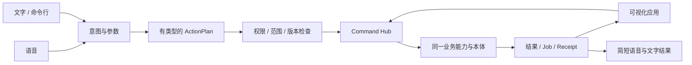

# DepDek AgentOS：产品定义与系统架构

> 版本：产品方向 v0.1
> 日期：2026-09-24
> 状态：新一代产品定义，作为 AgentOS 产品方向、系统层级与核心交互的主文档。
> 对象：拥有 NAS，想让 AI 真正管理资料、推进事务并替自己完成数字工作的人和团队。

## 1. 定义：一台让 Agent 替你工作的数据电脑

**DepDek AgentOS 是一套装在 NAS 上、以 Debian 为底座的 Agent 操作系统。** 它把文件和数据留在用户掌控的设备上，常驻连接用户授权的数据源；用户主要通过语音和自然语言告诉系统想完成什么，Agent 在统一权限与命令体系内调用应用并完成工作。用户日常看到的是有依据的答案、待决定事项和执行结果。

它同时是：

- **一台 NAS**：可靠管理磁盘、共享目录、快照、备份、账号、网络与应用服务。
- **一个 Agent 工作系统**：连接数据、建立业务本体、理解目标、编排操作、保存回执。
- **一个新的交互 Shell**：语音为核心输入，自然语言和软键盘随时可用；普通人不用知道文件在哪个应用里。
- **一个可编程平台**：人、Agent、终端脚本和可视化应用通过同一组有类型、受权限检查的业务命令完成操作。

用户不必先选择“邮箱 App”或“文件 App”，而是说：“把客户发来的终版合同放进北辰项目，找出付款节点，并提醒我审批。”系统从邮件和文件中找到来源，映射到本体，生成行动计划，在右侧展示简短的关键影响与证据，完成获准部分，回报结果。

**产品交付物仍然是 AgentOS 设备系统。** 用户可以购买/自组安装的 NAS appliance，也可以安装到受支持的通用 NAS 硬件。Debian 是裁剪、验证和维护的基础；浏览器、终端、手机是访问 Shell 的入口，不取代设备 OS。

## 2. 重新组织系统：任务在前，应用退后

现在的电脑先让人找应用、找文件、学操作流程，再逐个操作。AgentOS 把这个流程倒过来：用户表达目标，Agent 识别任务与权限，系统调用能力，用户检查结论或需要作出的决定。

### 2.1 一句话产品承诺

> 说出你要完成的事。AgentOS 会从你授权的数据里找到依据，替你推进，并清楚告诉你结果。

三个支柱：

1. **说出目标**：语音优先，也支持文字、键盘和无障碍输入。
2. **工作在数据上**：连接器取得来源，统一本体呈现项目、人物、承诺、文件和业务流程。
3. **结果可托付**：计划、授权、执行、审计与回执使用一套安全的系统命令。

### 2.2 日常 Shell 的布局

| 区域 | 内容与行为 |
|---|---|
| 顶部轻栏 | 产品标识、当前空间、设备/连接状态和清楚可见的麦克风/隐私状态 |
| 中央工作区 | 当前目标、Agent 简短答复、必要澄清和结果；同一屏只突出正在做的一件事 |
| 右侧工作面板 | 需要决定的事项、少量关键后台进度、刚完成的结果和回执入口；无事时保持安静或收起 |
| 底部交互区 | 语音、按住说话、文字输入和一键软键盘；物理键盘与辅助输入始终可用 |
| 业务视图 | 用户提出需要查看时打开，例如北辰项目本周承诺；仍从同一 Command Hub 读写数据 |

中间不显示冗长的工具调用过程；右侧面板显示对用户有影响的状态。不让用户翻菜单寻找功能，也不把聊天记录作为任务数据库。

语音是首要入口，支持打断、补充、纠正和简短语音回报。软键盘支持精确修改命令与参数，触屏上一步可唤出；物理键盘、输入法、复制粘贴和无障碍操作始终有效。用户可以说“看看本周北辰项目承诺”，系统随即打开可展开证据的项目视图。

语音处理要满足：

- 麦克风何时启用、音频去了哪里、是否正在云端处理，始终清楚可见并可立即暂停。
- 音频默认临时处理并丢弃；只有用户明确选择将录音作为工作资料时才保存，保存时同样遵守 Vault 和本体权限。
- 低功耗设备可以使用轻量级本地热词/命令路径；听写或复杂理解若需要外部服务，明确展示数据范围并遵循对应授权。
- Agent 的语音答复与文字同步，支持打断播报、重复关键数字和一键转为纯文字。

窗口、手机、电视/触摸屏或纯 SSH 都连接同一个 AgentOS 服务。头部信息密度和面板尺寸随屏幕变化，语义与可执行命令不变。NAS 无显示器时，由局域网浏览器、语音客户端或 SSH 完成首启和日常使用。

### 2.3 让 Agent 有人味，而不冒充人

Agent 的语言应自然、温和、简练，理解用户的长期目标和正在处理的工作；被纠正时直接承认并改正，信息不足时清楚指出缺什么。用户能区分 Agent 的职责和说话风格，但不需要经营一组拟人角色或读冗长的过程播报。

“有人味”体现在倾听、连续性、节奏、记得经用户确认的偏好、用一两句话说明做了什么及原因。它不依赖假装有情绪、用亲密关系催促批准或制造对 Agent 的依赖。每个结论可以展开证据，每项操作显示实际状态。

## 3. CLI 是系统的业务骨架

CLI 是一个明确的产品原则：**所有用户可感知的系统能力、业务操作和应用工作流都必须能被结构化命令完整表达。** 如果前端可以创建项目，命令接口必须能完成同一创建；如果命令可以完成一笔流程，前端不能另写一份绕开它的逻辑。

这不等于把 Agent 接到 Linux `bash`。通用 Shell 命令能任意读文件、运行任意程序，无法按项目数据范围授权，也无法保证预览、幂等和审计。因此需要两个边界清晰的命令空间：

| 入口 | 使用者 | 能力范围 |
|---|---|---|
| `depdek ...` 用户/业务 CLI | 用户、脚本、Agent 命令代理 | 对象检索、连接器、项目工作流、计划与执行；每项能力有 schema 和权限 |
| `depdek admin ...` 设备管理 CLI | 设备管理员 | 磁盘、网络、系统服务、更新、备份、诊断；敏感命令需要管理员能力 |
| Linux `bash` / `root` | 可信系统管理员 | OS 维护；Agent 默认没有 shell 或任意进程执行权限 |

Agent 通过 Command Hub 调用有类型的命令。它不会为了“实现 CLI 驱动”获得运行任意 bash 的权限。命令可走受约束的本地 RPC/套接字或认证的远程接口；协议只接受已注册命令，不接受拼接出的 shell 字符串。

产品应用中每个可见的业务操作都对应一个稳定命令；命令列表、参数说明、帮助、结果/退出码和机器可读输出也可从 CLI 查询。只有必要的可视参数编辑可以留在 UI，但最终仍提交同一结构化命令。

### 3.1 命令契约

每个系统/应用能力注册一份版本化 `Command Manifest`：

```yaml
name: project.commitment.follow_up
version: 1
summary: 为逾期承诺建立一项跟进任务
input_schema: { project_id: object_ref, commitment_id: object_ref }
output_schema: { task_id: object_ref, receipt_id: string }
capabilities: [project.read, task.create]
scope: workspace/project
side_effects: [create_local_task]
idempotency: required
preview: supported
compensation: delete_task_if_untouched
offline: supported
```

Manifest 还声明版本兼容、所需权限、数据密级、预算/数量上限、人工确认条件、检查点、超时语义、审计字段以及操作是否可补偿。运行前验证参数和当前主体权限，运行后返回结构化结果、工作任务 ID、版本、变更摘要和 Receipt。

一条有副作用的命令可以分阶段调用：

```text
depdek plan project.commitment.follow_up --project prj_17 --commitment cmt_42
depdek apply plan_8fa2                         # 授权策略允许时执行
depdek job inspect job_a21b                   # 进度、最近检查点或待处理例外
depdek receipt show receipt_b109
```

事件与后台任务按 **至少一次投递**设计：网络断开和进程重启后允许重放，接收命令使用稳定 `idempotency_key`，同一副作用不可重复。每个 Job 在写入检查点后推进输入游标；失败进入可见的重试/人工队列，重放只处理尚未提交的工作。跨远端服务无法承诺“恰好一次”；结果未知时先查询远端或等待核实。

自然语言、语音、CLI 和 UI 都调用相同的业务命令：



可视化控件用于让人容易找到、预览或修正参数，其提交结果仍调用同一条命令。这样企业可以用自己的 Agent、CLI、脚本或 API 组合应用，系统开发不再绑定某个专有界面。

### 3.2 人只看需要的信息

通常用户只收到最终结果和重要例外；当系统还没完成时，右面板显示“正在处理 12 个文件，预计还需片刻”，不把每次工具调用变成节目。关键节点自动记录，用户随时可以问“做到哪一步了？”

每个长任务具有幂等键、持久进度检查点、可继续/暂停/取消规则和失败补偿说明。已处理的批次重启后能够安全接续。外发、付款或远端删除即使调用超时，也先查明远端结果，不能凭猜测自动重复执行。

## 4. AgentOS 系统底座

系统保留 NAS 的重要工作，再把 Agent 能力置于其上。层与层通过权限明确的 API 和包连接，不允许应用自行绕开政策访问磁盘或数据库。

| 层 | 职责 | 面向对象 |
|---|---|---|
| 设备与启动 | 受支持硬件、启动与恢复、磁盘识别 | 固件、系统服务 |
| DepDek Device OS | 精简 Debian 系统包、内核/驱动、网络、安全更新、签名安装与恢复 | `depdek admin`、浏览器设置 |
| NAS 服务 | 共享文件、用户与组、磁盘卷、快照、备份、容器、远程访问/健康检查 | 管理员与本地应用 |
| Agent Platform | Vault/来源保存、连接器、对象本体、策略、凭据库、Command Hub、持久 Job、审计、模型路由 | 所有 Agent 与应用 |
| Agent Shell | 语音/文本交互、目标转计划、结果筛选、澄清和行动预览 | 用户及授权 Agent |
| 工作/领域应用 | 文件、消息、日历、项目、合同、交易及行业能力 | 人类界面、`depdek` 命令、外部 API |

Agent Platform 的数据语义**直接复用[本体与业务关联设计](workbench-ontology-design.md)**：`Object Type + Object + Assertion + Relation + Evidence + Function + Action`。那份文档负责“数据是什么以及为什么关联”；本文件负责“AgentOS 作为设备和交互产品如何工作”。应用不得各自重新建人物、项目、待办和权限副本。

部署四层与 Rust/RPC/sidecar/React 四个代码组件是不同的切面。Rust Core 继续做信任边界；sidecar 负责模型与连接处理；前端提供 Shell/业务视图；Device OS 管理硬件和常驻服务。Agent 只有明确定义的 capability，应用不能自己打开 Vault 根目录、SQLite 文件或 Secret Store。

### 4.1 NAS 服务必须保住

OS 安装和升级过程中，用户的数据服务要有清晰责任边界：

- **共享与文件**：本地用户和网络客户端可以稳定存取文件；Agent 读取要经过权限检查的 `vault/*` 能力。
- **版本、快照与备份**：对选定数据有明确保留规则；系统升级、合并或重写文件之前计算受影响对象并建立恢复点。
- **账号与网络**：设备管理员、家庭成员、企业主体和 Agent 工作身份分别管理，不能用一个 NAS 管理员账号代表所有 Agent 行为。
- **容器与连接服务**：已有 NAS 应用可以运行；外部服务的挂载/同步仍须登记为来源，不能通过宿主机 Root 绕过 AgentOS 数据权限。
- **诊断与设备状态**：磁盘、服务、同步与模型能力状态能在管理员 CLI 和 Shell 侧栏查询；隐私敏感的业务内容不进入系统日志。

### 4.2 Debian 发行版策略

采用“**Debian stable + DepDek 自己维护的设备层**”：基于当前 stable 为选定设备裁剪镜像，保留 Debian 包和更新路径，增补 DepDek 品牌、NAS 服务、Shell、驱动/固件清单和恢复流程。每份镜像记录准确 Debian 版本、内核、包清单和软件来源。Debian 项目对 derivative 的定位也是基于 Debian 构建、拥有独立身份和目标的发行版。[Debian derivatives](https://www.debian.org/derivatives/)

截至本文日期，Debian 官方列出 Debian 13/Trixie 为 stable，计划支持生命周期约五年。[Debian Releases](https://www.debian.org/releases/) 这只定义底座节奏；DepDek 必须另行承诺自己内核、驱动、容器镜像、Agent 组件的安全补丁与设备支持期限，不能把上游 EOL 直接说成整套产品仍然安全。

正式方向坚持 appliance OS。工程上先制作为可重现安装镜像和受支持硬件清单，再逐步完成引导、签名升级、恢复分区、安装向导、数据盘迁移与回滚。开发者可额外用容器/安装包在普通 Debian 上运行同一服务作为开发环境；它是工程便利模式，不是产品定位或首屏卖点。

设备更新要区分 **系统盘**和**数据盘**。系统分区宜原子升级/失败回退；用户数据与本体库有独立备份和 schema migration。系统镜像回滚不能回滚或丢掉新产生的业务对象。A/B 分区在硬件、引导链和升级签名设计明确后定型；优先级高的首先是系统更新失败不破坏数据、用户可导出和恢复。

## 5. 信任模型：容易托付，也容易理解

所有数据请求先校验身份、工作空间、来源授权和用途。所有动作经过可检查的 Plan/Action，与界面或是否展示进度无关。

### 5.1 授权是一份可读的范围

授权记录至少定义：**数据范围 × 能力 × 执行主体 × 有效期**，并可加对象数、文件类型、单次金额、目的地、网络范围等上限。例如：“这 30 分钟内，仅允许‘邮件整理 Agent’读取 `projects/北辰/2026Q3/` 下的邮件附件，并把去重后的副本写入该项目归档区；最多 50 个文件，不得删除和外发。”

批量操作先生成一份差异预览，明确受影响的记录数、目标位置、样例、跳过项和可恢复范围。一次决定覆盖符合已展示范围的操作，不重复弹 200 次确认。新数据、越界数量、权限变化或新副作用会形成新的决定点。

风险对应行为而不是泛化等级：“读取项目合同”是数据读取权限，“生成建议”是一种处理，“发给客户”是具有外部后果的独立能力。删除、发送、付款、共享到其他工作空间等按动作目的与用户策略授权，并披露不可撤销的部分。

### 5.2 把可撤销承诺说准确

| 动作 | 处理方式 |
|---|---|
| 本地文件/字段修改 | 先存版本/快照；适用时提供撤销 |
| 本地创建的任务/关联 | 记录前一版本和来源；可以新增补偿动作或恢复旧状态 |
| 已发送邮件/远端删除/支付 | 执行前预览并按策略授权；执行后对账；失败时未知状态先核实 |
| 外部服务没有幂等键、也不能查状态 | 不自动重试；保留未知 Receipt，等待用户检查 |

Receipt 记录实际结果。删除来源后，先阻止检索召回，再异步清理文本/语义索引；真正清除原件、备份与第三方副本的边界在产品里分别说明。只在向量索引中加墓碑仍能被召回，不算完成删除。

持续运行的 NAS 不能因审计日志耗尽小容量设备空间而停止服务，也不能静默丢失安全记录。业务进度遥测和不可抵赖审计要区分；进度可合并或限量保留，权限、外发和数据变更审计需完整、可核对地留存。未来对 append-only 审计的分段归档、保留和用户导出策略要设计为签名/哈希可核验的封存段，并保留清楚的删除授权记录；当前文件尚无轮转策略，不能假设已经支持。

### 5.3 磁盘保护与检索

本地磁盘加密与全天候后台工作必须作为一次设备初始化选择来设计。选择手动解锁时，重启后数据分区在管理员解锁前保持关闭，对应同步和 Agent Job 暂停；选择无人值守启动时，需要设备级密钥保护和物理接管风险说明。没有可信硬件密钥存储的设备，应提供管理员口令解锁路径，不能把明文解锁密钥放在同一块未加密盘上。

可搜索内容与用户明确限制索引的内容分开治理：全文/语义索引均继承来源权限，撤权先阻断召回；索引在静止存储时加密，与源对象一起备份/迁移/清理。要允许敏感内容不被索引，同时准确告知用户跨源搜索将看不见这部分数据。数据加密、搜索可用性、模型外发与后台解锁不是一个单独的“隐私开关”，需要按设备设置向用户说明组合结果。

## 6. Agent 运行时与硬件诚实原则

AgentOS 可以云端或本地使用模型，但“在 NAS 上运行”不等于“每台 NAS 都能本地跑大模型”。语音输入、简单意图解析、快捷命令和设备操作可建立经过实测的本地路径；长篇理解与高质量语音识别依硬件、模型和用户选择路由。低内存设备不会宣称拥有未实测的本地推理体验。

按经过测试的 RAM、处理器、NPU/GPU、磁盘和网络能力声明设备级别，并公开每类设备支持的语音/模型功能、速度、容量与默认隐私路由。功能不足时清楚告诉用户并给出可选路由；云端语音或文本调用要显示数据范围、目的地和正在外发状态。管理员或用户可限制云端能力及网络目的地。

保留有用的离线体验：已有本体、文件浏览、已授权本地规则、待办和已缓存结构化答案可用；需要云端模型/服务的能力标明不可用并入队或说明原因。设备断网不会假装已经发信、同步或完成在线查询。

## 7. AgentOS 的首发体验

首发承诺不能是“什么都能做”。先把一个跨数据来源、完成后看得见价值、能正确恢复的工作闭环做得可信。建议从本体设计已经给出的**项目承诺管理**开始：邮件/日历/文件进入 Person、Project、Commitment、Task；Agent 给出有证据的关系候选；用户通过语音或键盘确认范围；系统把确认过的承诺变成持续跟踪的待办，到期后能回答进展并给出跟进草稿。

示例对话：

```text
用户：刚才和北辰那封邮件里，我们答应了什么？

Tanvis：有一项。邮件里约定周五前给一版接口清单，发件人是王工。
        我还没确定“王工”对应通讯录里的哪位联系人，先给你看这封原信。

用户：王工就是王伟。给我跟进，但先别发出去。

Tanvis：好，我把王伟关联到这封邮件，并在北辰项目下建了一条本地跟进待办，
        周五提醒你；没有发出任何邮件。右边可以查看证据和待办。
```

首次确认身份属于关系裁决，不代表给 Agent 额外的邮箱能力。创建本地待办按已设授权运行；发送草稿是独立的下一步。右侧显示来源、候选处理、待办创建及撤销本地待办的入口。系统如未建立送信 Receipt 就不能说“已通知客户”。

这一个闭环需要验证语音/文字输入、汉语日期、实体候选、权限范围、Command Hub、Agent 有人味的澄清、CLI/UI 一致性、幂等任务、断网恢复、批量审批和审计。它同时检验 NAS 设备服务是否可用，但不要求所有硬件都运行大型语言模型。

## 8. 产品开发路线

| 阶段 | 交付 | 可以宣布的产品能力 |
|---|---|---|
| A. 设备底座 | 精简 Debian 镜像、磁盘/网络/账号、NAS 共享/快照/备份、签名更新与恢复、首启界面、设备兼容清单、凭据 Secret Store | 一台可安装、可远程管理、可恢复数据的 DepDek appliance；远程连接凭据不明文保存于普通配置 |
| B. Agent Shell | 统一 Command Hub、自然语言与语音/键盘输入、右侧工作面板、短结果与回执、权限计划 | 用户能用说话/文字启动并追踪一项受限工作 |
| C. 可信业务闭环 | 只读连接器、现有本体对象映射、承诺管理、Local Job/Receipt、支持撤销的本地动作 | 一个跨邮件、日历、文件、待办的真实业务流程 |
| D. 可编程生态 | 公共 Command Manifest、CLI/JSON 接口、UI 插件规范、Capability 与商店、审计/数据导出 | Agent、应用与用户脚本复用同一业务能力 |
| E. 硬件与团队规模化 | 更多架构/设备配置、企业服务端、身份/密级/撤权、异地备份与多设备共享 | 团队共享工作空间和可验证的设备支持承诺 |

A 阶段的设备 OS 与 B 阶段的 Shell 是产品基础，可同时搭建原型；在可信企业身份、服务端授权、多用户审计就绪前，不把本地账号能力描述成已具备企业多人生产安全。每个阶段都有数据恢复演练、命令一致性和安全边界验收，完成后再开启下一个能力层。

## 9. 成功指标

- **完成时间**：用户从表达目标到得到正确结果花了多久、走了几次手工操作。
- **托付准确性**：命令解析后被用户改动的比例、关系误确认/撤回比例、承诺漏报率。
- **执行可信度**：重启后重复副作用率、未知结果恢复率、任务检查点恢复成功率。
- **有用的安静**：每个完成事项需要多少次打扰；用户事后是否能找回结果与证据。
- **设备可靠性**：安装成功率、更新/恢复演练成功率、支持设备的磁盘与内存余量、补丁及时性。
- **数据控制权**：备份恢复率、导出完整性、撤权阻断时间、删除从召回层消失的时间。
- **多入口一致性**：同一工作流从语音、CLI、UI 发起的结果、权限检查和审计记录一致。

模型 token 数、应用打开次数和 Agent 对话长度不是产品成功指标。

## 10. 与现有文档的关系

这份文档是新的产品总定义；和它在个人数据主权、事实可回溯、Proposal/Action/Receipt 上一致的旧方案继续有效。系统交付、用户入口、Shell、CLI 和 OS 相关定义以此文档为准。

| 文档 | 权责 |
|---|---|
| `workbench-ontology-design.md` | 事实模型、本体、对象/属性/关系、清洗与业务关联；本定义引用，不重复发明第二套 schema |
| `contract.md` | 已实现/已发布 Rust、sidecar、React 接口唯一事实源；本文建议的命令是产品目标，落地前必须修改契约并同步各层 |
| `DepDek 2.0 Concept.md`、`DepDek 2.0 PRD.md` | 保留数据 OS 的个人数据用例、原则和对象；原版本的导航、App/Chat 层级、迭代时序不再定义 AgentOS 外壳 |
| `DepDek 2.0 Information Architecture.md` | 历史信息架构参考；新 Shell 的核心布局与语音交互遵循本文 |
| `depdek-version-roadmap.md` | 现有 V0.x 工程历史/兼容参考；新的产品增量顺序以本文阶段表为目标，待后续分解 Sprint |

现有实现已经把 Agent 文件访问收敛到 Rust Vault 和受限 `vault/*` RPC，契约明确不向 Agent 提供通用 bash；这是 Command Hub 可以延伸的信任基础。当前 `mail/accounts.json` 仍将密码明文存入本地 Home，[现行契约 §7](contract.md#7-邮件存储约定)也写明此兼容方式；AgentOS 的正式设备版本应在打开外部访问、远程 Shell 和团队账户之前完成 Secret Store 迁移，而不是把文档目标误当成现状。
