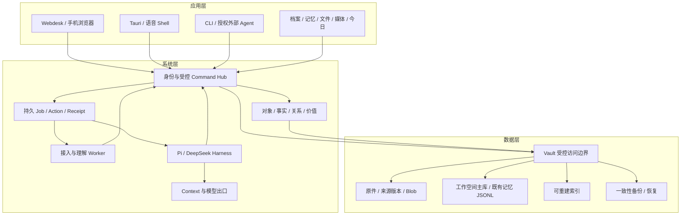

# DepDek V2.0 AgentOS：整体架构

> 工程草案，检查基线与文档效力见 [总览](README.md)。接口见 [API](api.md)，数据见 [数据设计](data-model.md)，实施见 [重构计划](refactor-plan.md)。

## 1. 系统目标与边界

DepDek 是以 Linux 为底座的家庭 AI NAS OS：保存原件，将资料组织为可纠正的家庭知识，并让 Agent 在授权范围内完成事务。用户通过语音、文本、CLI 和可视化业务视图访问同一套能力。

首发对象：家庭成员、房屋/房间、物品、凭证、维护事件和待办。核心场景为“准备某件物品的维修资料”。企业项目与交易沿用现有本体领域包，后续进入服务端多人部署；家庭首发不等同于已具备企业多租户能力。

必须成立的系统性质：

- 原件、识别产物、经确认的知识、使用偏好和行动回执分别管理。
- 任何可见事实有固定来源版本；冲突保留，未知值不补成正常值。
- Agent 读取权限不高于授权人的委托范围；设备管理员不自动获得私人内容权限。
- UI、CLI、Agent 工具执行同一条业务命令，成功由结构化结果与回执判定。
- NAS 服务、业务服务独立于 GUI 存活；关掉桌面窗口不停止同步或任务。
- 本地变更有版本/补偿能力；已外发、付款等不可逆效果有事前授权与事后核验。

## 2. 现有实现审计

| 模块/事实 | 代码依据 | V2 处置 |
|---|---|---|
| Rust Vault 路径沙箱、文本/二进制与压缩、操作审计 | `src-tauri/src/vault.rs`、`audit.rs` | 保留安全实现与逃逸测试，抽离 GUI 生命周期 |
| Node Pi 会话、文件/媒体/邮件/记忆技能 | `sidecar/src/sessions.ts`、`tools.ts` | 保留 Adapter；由服务端权限与 Manifest 替代仅 sidecar 工具白名单 |
| dsh 临时目录、禁用文件/shell/web工具；有限历史 | `sidecar/src/harness.ts` | 保留隔离，新增能力探测和标准事件；工具桥接单独验收 |
| 记忆候选/确认/拒绝/墓碑、JSONL 查询 | `src-tauri/src/memory.rs` | 保持事实源；当前范围过滤不是可信多成员 ACL |
| “append” 当前通过读取旧字符串再写整个文件 | `memory.rs::append_unlocked` | 修复实际持久追加、尾部恢复和权威序号，保留事件格式兼容 |
| 邮件/日历网络连接及 JSON/Markdown 落盘 | `sidecar/src/mail.ts`、`calendar.ts` | 转为连接 Worker + 受控出口；旧接口先保留 |
| TodoBus 去重队列 | `sidecar/src/todo.ts` | 先只读投影为 Task，再按领域切主写 |
| 前端 TaskRecord 仅 running/success/error，历史写 Home | `src/taskTypes.ts`、`DepDekHome.tsx` | 迁为服务持久 Job；旧运行记录作为历史，不能恢复外部动作 |
| Obsidian 外部根只读列举/读取 | `src-tauri/src/obsidian.rs` | 根授权进入 Vault，增加确定性解析和受权限限制图投影 |
| Webdesk 单管理员、指标、只读共享、四人聊天 | `webdesk/src/`、`webdesk/web/src/` | 保留 BFF 与独立进程，家庭业务通过新服务调用 |
| 独立 Harness 服务与 Provider 配置 broker | `agent-service/` | 合并执行协议；broker 迁为更窄 Secret/Config 服务 |
| logical space、SHA-256 内容地址、JSON state | `space-service/` | 保留资源/Blob 算法，关闭与 daemon 并发的直写，迁为受控存储后端 |
| Debian 镜像、Calamares、Vosk、本地 Shell | `os/`、`DepDekAiOsShell.tsx` | 保留工具链；NAS 服务、真机安装、升级与恢复另有发布门 |

当前未实现：统一对象主库、完整家庭 ACL、数据理解流水线、价值引擎、统一 Command Hub、可恢复业务 Job、完整 NAS 快照/备份管理。桌面 Provider、邮件与日历凭据仍存在普通配置明文兼容债务；Webdesk 的 root-only env 也不等于整套 Secret Store 已完成。

## 3. 三层中间件与四个产品引擎

| 中间件层 | 模块 | 四个产品引擎对应关系 |
|---|---|---|
| 数据层 | Resource/Vault、Blob 与版本、SQLite、来源证据、备份、索引 | 存储底座；知识资产持久化 |
| 系统层 | 身份/授权、Command Hub、Job、连接接入、理解流水线、知识与价值计算、Context、Model Gateway、审计 | 数据理解引擎；家庭知识与价值引擎；Agent 运行治理 |
| 应用层 | Agent Shell、领域视图、技能应用、NAS 管理、CLI/MCP 接入 | Agent 服务与用户可见家庭服务 |



图中模块是逻辑分工。V2 首期采用一个业务 daemon 与独立 Worker，不将每个逻辑模块拆成网络微服务。

## 4. 进程与所有权

| 进程 | 身份/资源 | 允许行为 | 禁止的旁路 |
|---|---|---|---|
| `depdekd` Rust 业务服务 | 非 root 业务服务账号；持有受管工作空间 | 授权、事务、受控文件、Job、事件、审计 | 通过通用业务接口暴露数据库/密钥/任意系统路径 |
| `depdek-webdesk` BFF | 独立 Web 服务账号、自有配置/缓存 | 登录转发、业务 API 转发、指标与 SPA | 直接读取 Home、SQLite、原件目录或 Secret Store |
| Tauri Shell | 登录用户，本地会话凭证 | 调用本机 daemon，持有非权威 UI 状态 | 在 daemon 模式同时成为业务主写 |
| Agent Worker | 独立低权限账号，run-scoped 委托 | 推理、受限工具请求、标准事件 | 用户目录挂载、fs/bash、SQL、真实 Provider key |
| Connector/Extractor Worker | 任务级输入句柄与有限输出 | 固定协议接入、沙箱解析、候选生成 | 任意联网、打开来源根、自行确认事实 |
| Model Gateway | 服务端受控出口 | 已授权模型请求、流式归一、成本与外发记录 | 让调用方自由指定新目标地址或读取凭据 |
| Secret broker | 系统/平台凭据权限 | 固定服务的秘密写入、轮换与租约 | 通用文件/命令执行、返回秘密给 UI/Agent |
| Device broker | 极小 root 服务 | 磁盘/网络/共享/系统服务的注册动作 | 通用 shell、家庭内容浏览 |
| NAS 服务 | 各服务独立账号与共享授权 | SMB/选定共享协议、备份、应用运行 | 默认共享受管 DB、密钥、全部私人原件 |

`depdekd` 初期内置 Command Hub、Job Scheduler、Knowledge、Context 和索引器，Worker 在子进程隔离。指标采样仍归 Webdesk；设备写操作经 Device broker。

单机家庭多成员通过服务 API 写入同一权威进程，SQLite 文件置于本地受管磁盘；客户端不通过 SMB/NFS 打开数据库。企业高并发/多节点可替换数据库后端，保持对象与命令语义，需另做负载和隔离验证。

## 5. 唯一数据安全边界

当前安全校验保持在 `src-tauri/src/vault.rs`。重构顺序为：先给它增加受管根/主体/工作空间入口，再原样提取到 `crates/depdek-core/src/vault.rs`。更新 AGENTS 与正式契约必须与提取代码同批完成；本次仅设计。

领域模块只做类型、业务约束与版本校验。路径、资源句柄、数据范围、调用主体、受管文件保护、网络外发政策的最终访问决定由 Vault 受控入口完成。策略模块可计算判定，但所有访问调用均经过这个入口，不能在 sidecar 再实现可绕过的授权。

保护对象包括 DB/WAL/SHM、JSONL 记忆源、凭据元数据、策略、内部索引、备份密钥、原件内部 Blob、审计与 Manifest。通用 `file.read/write` 仅暴露登记的用户文件资源，不能以路径工具修改上述权威资产。

Obsidian 是现有独立路径校验的例外，迁移后使用 Vault 授予的外部只读 ResourceHandle。物理存储后端只接受 Vault 签发的 root/file handle；其 I/O 实现不再次从客户端路径自行打开目录。

身份来自认证会话与服务连接，不信任 JSON 中的 `session_id`、`actor`、`role`。Unix peer credentials 只能证明连接进程，不能单独证明浏览器最终用户；Webdesk 必须携带业务服务签发的用户会话/委托。Device broker 再核验短期操作票据、来源服务与固定动作参数，这是独立的 OS 提权边界。

## 6. 三条数据流

### 6.1 接入与理解

上传/连接 → 暂存与校验 → 封存来源版本 → 接入完成 → 解析 → 标准化 → 索引 → 知识候选 → 用户决策。

每个阶段保存版本化输入、产物引用和 JobStep；失败只重试失败阶段。原始内容成功提交之前不推进连接游标。解析器运行在资源受限进程，设置文件类型、解压深度、内容大小和时间预算。

确切的文件日期、PDF 页码、人物提及属于不同字段。识别模型输出 candidate；规则只能对 Manifest 允许的确定性字段自动确认。发票日期与用户日期同时保存，关系合并可以撤回。

### 6.2 查询与 Context

身份/范围过滤 → 授权对象集 → 有界检索与遍历 → 固定版本证据 → 来源新鲜度/冲突 → ContextSnapshot → 回答。

ACL 在排名前限定候选集，返回前再次校验；向量索引若只能全局召回，必须限制到授权分区/允许 ID，或回退授权集合全文检索。任何不可见结果的标题、计数、关系存在性和片段都不能泄露。

Context 包含明确的输入版本、来源引用、派生关系和预算。已确认记忆参与默认 Context；来源正文只作为资料。撤权/墓碑先同步阻断读取与模型外发，再异步清理索引。

### 6.3 行动

目标 → 有类型的 Plan → 参数/证据/版本检查 → 授权或右侧确认 → 持久 Job → 执行 → 结果核验 → Receipt。

查询可直接执行。授权工作区的草稿/资料包可按已有范围授权执行；批量计划支持数量、路径/对象范围、有效期与预算。外发和原件永久删除使用相应独立授权。

外部响应丢失时 Action 进入 unknown；核验远端结果，再决定是否重试。无幂等能力且无法核验的发送不能自动重放。补偿创建新 Action，保留原回执。

## 7. 平级执行器与模型出口

`AgentDefinition` 定义角色、技能、默认 Engine/Provider 和可申请能力；技能不是授权本身。实际权限取用户、工作空间策略、run 委托与技能声明的交集。

| 能力 | 当前 Pi | 当前 Harness | V2 要求 |
|---|---|---|---|
| 会话/分析 | 已有 | 已有，headless 每轮进程 | 同一 Run/Session API |
| 受控 Vault 工具 | 已有，sidecar 白名单 | 当前无 Vault RPC | Adapter 声明 tools 支持，桥接通过验收才开放 |
| 记忆 Context | 本地 provider 有界注入 | 同一装配器可注入 | 同一权限快照与外发约束 |
| 真正流式 token | 已有事件 | 当前多为完成后 text_delta | 如支持则归一，否则显式 batch |
| usage | 有实际值时返回 | 可能缺失 | 缺失为 unknown，不按字符冒充 token |
| 任务恢复 | 会话级，无持久业务检查点 | 同左 | Job 权威在业务服务，Adapter 无主写权 |

Engine 协商返回能力、版本和健康状态。无法完成某技能时返回 capability_unavailable，用户可选择其他执行器；不静默换模型或外发。

Model Gateway 统一处理本机、登记的 LAN 计算节点和云端。Provider 登记包含固定 endpoint、协议、模型能力、信任类别与凭据引用。主机名为 localhost 不足以永久证明数据未外发，还要校验最终地址、代理配置与重定向。

Pi 迁为注入受控模型 transport；Harness 优先通过版本固定的 API/插件连接 Gateway。若需要 OpenAI-compatible 本机代理，给 Worker 一次 Run 的短期代理 token，真实 Provider key 只由 Gateway 使用。隔离网络只允许代理端点；Linux 网络命名空间/受控转发是正式路径，单靠 URL 约定不构成出口隔离。

Harness 自定义工具插件与代理协议必须在 R0 做可行性验证。未通过时保持 text-only 能力，它仍拥有相同治理地位；不会恢复 dsh 默认 fs/bash/web 工具来获得表面功能一致。

外发授权绑定 Provider、目的、来源版本集合、可派生产物、总字节/请求预算和有效期。计划中新增范围之外的材料时重新取得授权。UI 显示可观察的工作阶段、工具动作和结果；隐藏思维不作为事实、审计或完成依据。

### 7.1 Agent Team 与协作

首期沿用西游四人 IP，角色可改名/换模型，不将模型厂商写死在角色里：

| 默认角色 | 主要技能 | 默认不能获得的能力 |
|---|---|---|
| 悟空：探索与统筹 | 澄清目标、检索、分解计划、核对结果 | 替用户批准外发/删除、随意分派全库权限 |
| 八戒：资料与执行 | 文档/照片整理、资料包、音乐/视频调用 | 磁盘/网络/账户管理 |
| 师傅：分析与指引 | 冲突解释、价值说明、事务草稿 | 自动把推断确认为事实 |
| 沙僧：整理与守护 | 已授权归档、待办、记忆候选、备份状态解释 | 自行确认长期记忆、格式化磁盘 |

AgentDefinition 与 SkillManifest 分别版本化，UI 展示可用/不可用技能、真实任务状态、已完成回执和实际 token。角色拟人化只影响表达与形象，不改变权限。

默认每个角色有独立 Session；共享的是获准的知识与长期记忆，不是自动复制全部私人聊天。多人协作房间须显式登记参与者与消息可见范围，派生摘要不得扩大范围。

多 Agent 执行由一个根 Job 管理，子 Run 的授权取父委托与子技能能力交集，不能扩大范围。委派只传最小 Context 与任务产物引用；根 Job 汇总证据并核验结果。子 Agent 的“用户同意”文本不构成 Decision，所有副作用仍由 Command Hub 的 Action 幂等键执行。初期先跑单 Agent 闭环，显式委派在后续编排阶段开放。

## 8. Shell 与应用协议

- 左侧：Agent、可用技能、在线/运行/等待决策状态；角色动画尊重 reduced-motion。
- 中央：用户目标、简短澄清与 Markdown 结果；工具过程收敛为单个可滚动框。
- 右侧：由可信 PanelSpec 驱动的对象选择、冲突核对、来源预览、计划确认、资料包、媒体和回执。
- 底部：按住说话/点击录音、文字与软键盘；语音转写先回填。打断只取消可取消部分，已提交外部行动不假称撤销。
- 全屏保留退出全屏；Dock 自动隐藏仍支持键盘/触屏访问。

PanelSpec 只引用注册命令和当前可见对象，不允许任意 JS、HTML、shell 或模型生成的外部跳转。Markdown 继续经过内容净化。语音输入音频临时处理；家庭资料的音频转写属于另一类需要保存来源与权限的解析 Job。

文件、物品、日历、待办、相册、音乐与视频应用都声明 Command Manifest。媒体通过授权的 Range 内容接口播放，不把大文件转为 base64 塞进模型 Context。

## 9. NAS 与设备 OS

基于 Debian 裁剪镜像，保留上游包管理和安全更新来源，维护具体硬件/内核/固件矩阵。NAS 功能包括共享、容量/磁盘健康、备份恢复、用户与组、选定应用运行服务。

数据盘与系统盘分离。系统发布包含签名、构建清单、组件锁文件与恢复版本；首期可用应用包升级与恢复介质，A/B 升级进入后续设备阶段。升级回退不覆盖新写入的家庭数据或业务数据库。

存储管理复用现有 space-service 的 Resource/Blob 语义：用户看到容量、卷/共享、数据位置、备份与健康；Agent 使用 resource ID，不使用任意 /dev 或主机路径。热层缓存可重建，持久层保存原件，云层初期只是策略/连接元数据，实际上传必须有 Connector、加密与外发授权后才启用。不能把已有 cloud 字段当成云备份已完成。

设备命令通过登记的 device/resource ID 执行固定操作。格式化、重建阵列、恢复覆盖等须检查序列号/挂载状态/影响范围，给出精确 diff 和独立管理员授权；家庭内容授权与设备提权不互相代替。Device broker 不接受任意命令字符串，即使内部使用系统工具也只能由固定动作组装受校验参数。

SMB 共享的用户工作区与受管原件库分开。外部修改由目录连接器取得新版本；数据库、索引和系统配置不共享。加密数据盘锁定时，只启动最小网络/登录/解锁服务，家庭同步与 Agent Job 等待解锁。

无 TPM 设备使用用户主密码/恢复密钥方案；自动解锁是可见的设备策略选择。OS 账号管理、共享组与业务 Principal 映射需要明确登记，不能用 root 代表家庭成员。

“设备管理员不自动读私人内容”是产品账号与服务授权边界，不承诺抵御已完全控制 root/内核的攻击者。关机加密、服务隔离与恢复密钥策略分别缓解不同风险；共享空间成员看到已导出的材料后无法强制追回。

## 10. 凭据、可观测性与资源预算

Secret broker 支持平台 Keychain 与 appliance 系统存储。Linux 秘密加密保存，解密密钥来自解锁策略/受支持系统机制；0600 只解决权限，不代表加密。普通 DB 仅有 CredentialRef 与状态，UI 提交秘密后不读回。

现有 `/etc/depdek/agent.env` 作为兼容导入源。迁移验证后，服务改用凭据租约或 systemd credentials；旧 broker 不再直接重启整个服务来切换默认 Provider。systemd 的凭据加载机制可用于服务隔离，部署需按目标系统版本验证；普通 LoadCredential 与加密凭据须区别对待。[systemd 凭据说明](https://systemd.io/CREDENTIALS/)

审计覆盖访问、授权变更、模型外发、计划决策、执行与迁移。业务变更与 audit_outbox 同事务；读取审计在返回前成功入队。审计写入失败时拒绝敏感操作。JSONL 导出按大小/时间轮转，保留策略、校验链与导出能力可配置；哈希链用于检测改动，不宣称能抵御完全控制设备的 root。

低端设备先保障存储/检索/权限/队列。解析与索引设置并发、内存、磁盘空闲、水位和优先级；GPU/大模型是可选资源。暂停后台解析不阻断原件接入；磁盘临界时拒绝新上传并显示原因。

记录 Job 成功率、修正率、证据覆盖、恢复率、授权阻断、查询延迟和用户事务完成时间。Token 与实际费用分开：Provider 无 usage 时显示未知；估算必须明确标记。

## 11. 目标代码结构

```text
crates/
  depdek-core/          vault.rs / audit / identity / policy / command / store
  depdek-domain/        ontology / family / value / query / action / context
  depdek-protocol/      从 schemas 生成类型；无授权/业务决策
services/
  depdekd/             生命周期、调度、IPC、业务模块装配
  depdek-secret/       受限凭据 broker
  depdek-device/       受限设备 broker
workers/
  agent/               从 sidecar 渐迁，Pi/Harness Adapter
  connector/           先共用现有 Node 包的逻辑模块
  extractor/           可替换格式解析/本地模型 Worker
packages/
  client/              typed API 与事件恢复
  ui/                  来源、确认、进度、媒体、PanelSpec 组件
  manifests/           技能/命令/家庭领域包定义
src-tauri/             GUI 宿主与 v1 兼容适配
src/                   桌面 Shell 与领域视图
webdesk/               独立 BFF / 设备指标 / Web Shell
space-service/         迁移期间旧 CLI；最终存储后端与兼容入口
os/                    镜像、首启、服务、更新、恢复与硬件验证
```

这是迁移终态目录，不要求一次搬迁。core 提取、命令接入、主写切换分批完成；每步保持旧客户端可用。
