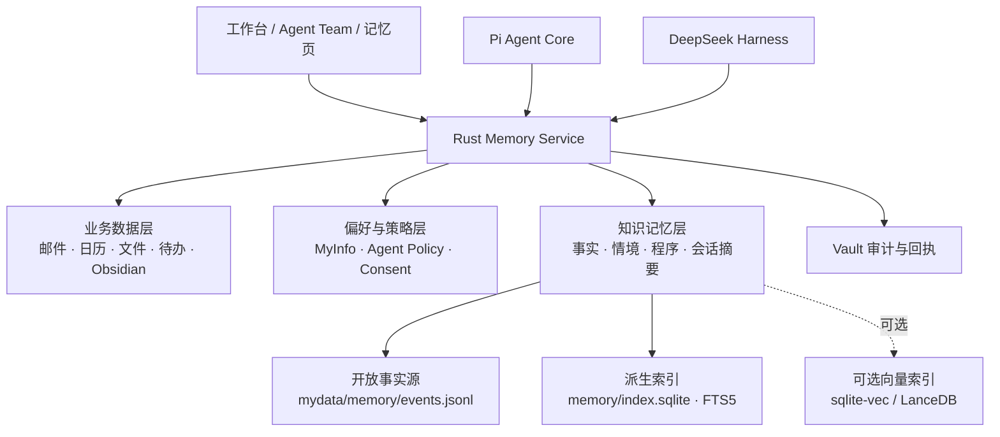
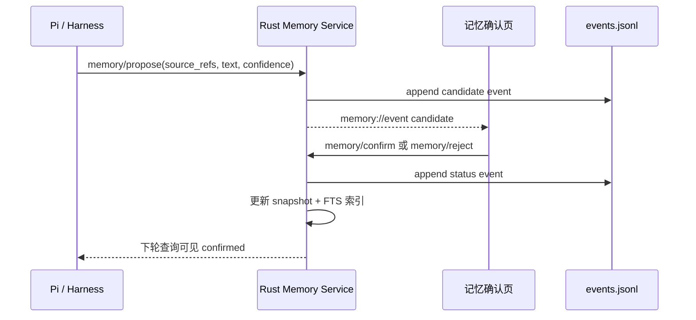

# DepDek Agent Team 共享长期记忆设计

> 版本：Draft 0.1 · 2026-08-17
> 目标：在不扩大 Agent 权限、不把个人数据送出本地的前提下，让 Pi 和 DeepSeek Harness 共享一套可审查、可撤销、可迁移的长期记忆。

与现有运行时事件和 `MyInfo/MyData` 兼容基线的关系见
[`agent-runtime-and-memory.md`](./agent-runtime-and-memory.md)。本文件是 Agent Team
共享记忆的落地设计；在 V0.3 迁移完成前，旧的 `mydata/long_term.jsonl` 仍可被读取，
不会因为升级而丢失已有记忆。

## 1. 结论先行

DepDek 不直接把 Mem0、Chroma、Qdrant 这类完整记忆服务塞进桌面端。首版采用一条简单的本地优先路径：

1. **原始数据仍由各领域保管**：邮件、日历、文件、Obsidian 和待办不搬进记忆库，记忆只保存摘要与来源引用。
2. **共享记忆以开放 JSONL 为事实源**：用户可以直接备份、导出、审阅和修复；每条记录带来源、状态、范围和有效期。
3. **Rust Vault 持有派生索引**：V0.3 先用 Rust 内存索引对 JSONL 做结构化筛选和关键词检索；V0.4 再落 SQLite + FTS5。sidecar/Agent 只能走 `memory/*` RPC，不能打开文件或数据库。
4. **语义向量是可选加速层**：达到规模后再接 `sqlite-vec` 或 LanceDB；它们都只能做可重建索引，不能成为事实源。
5. **候选记忆与已确认记忆严格分开**：Agent 只能提出候选，用户确认后才进入其他 Agent 的默认上下文。

这样既能实现“Agent Team 共享长期记忆”，又不会把记忆系统变成一个不可解释的黑盒。

## 2. 参考图对应的三层结构



### 2.1 业务数据层：事实在哪里产生

业务数据是“证据”，不是记忆。保持现在的目录和审计边界：

```text
mail/                  邮件 Markdown、附件和索引
calendar/              日历事件和同步回执
files/                 本地文件及其元数据
obsidian/              只读连接，不复制原文
tasks/                 待办队列和任务历史
```

每条记忆只引用这些数据，例如 `mail/QQ邮箱/1739.md#body` 或 `calendar/events.json#evt_42`。原文删除或撤权后，记忆检索必须立即失效或标记为 `expired`。

### 2.2 偏好与策略层：决定“怎样理解我”和“能不能使用”

```text
myinfo/profile.json             用户确认的身份、偏好、长期约束
agentteam/policies.json         Agent Team 共享策略
agentteam/agents/<id>/policy.json  单个 Agent 的读取范围和写入权限
privacy/consents.jsonl          每次云端外发和记忆使用确认回执
```

偏好不是普通知识。它不参与相似度竞争，按优先级和适用范围直接注入，例如“中文回答”“不要自动发送邮件”。

### 2.3 知识记忆层：Agent Team 的长期共享空间

首版使用以下布局：

```text
mydata/memory/events.jsonl      规范化后的追加事件，唯一事实源
mydata/memory/snapshot.json     可选的最新状态快照，崩溃后可重建
mydata/memory/index.sqlite      V0.4 计划的 SQLite 派生索引，不可手工编辑
mydata/memory/exports/          用户导出的 JSONL/Markdown
```

迁移期间，`mydata/long_term.jsonl` 和已确认的 `myinfo/profile.json` 会作为只读兼容输入
出现在 `memory/query` 中，自动带上 `source_refs`，但不会在读取时改写用户 Home。后续执行
显式迁移/重建时再将兼容记录物化为事件；这样当前版本的本地上下文读取逻辑仍然有效，升级
也不需要一次性改写用户 Home。

`events.jsonl` 每行一个事件，更新和删除也不覆盖历史：

```json
{
  "event_id": "evt_01J...",
  "op": "upsert",
  "memory": {
    "id": "mem_01J...",
    "scope": "team",
    "kind": "procedure",
    "text": "涉及外部写操作时，先给出预览并等待用户确认",
    "status": "confirmed",
    "sensitivity": "private",
    "confidence": 0.98,
    "source_refs": ["settings/policy.json", "session:agent-team"],
    "created_by": {"type": "user", "engine": null, "session_id": "user"},
    "valid_from": "2026-08-17T00:00:00Z",
    "valid_until": null,
    "supersedes": null,
    "created_at": "2026-08-17T00:00:00Z",
    "updated_at": "2026-08-17T00:00:00Z"
  }
}
```

## 3. 记忆模型与共享范围

### 3.1 记忆类型

| kind | 用途 | 默认状态 | 示例 |
|---|---|---|---|
| `fact` | 有来源的稳定事实 | candidate | 常用邮箱、项目名称 |
| `preference` | 用户偏好和输出方式 | candidate | 中文、先结论后细节 |
| `constraint` | 不可违反的限制 | candidate | 不自动发送、不外发敏感数据 |
| `procedure` | 用户确认过的工作方法 | candidate | 邮件先加入待办再回复 |
| `episode` | 一次任务或对话的摘要 | candidate | 本周处理了某个申请 |
| `summary` | 多条证据的压缩摘要 | candidate | 某项目的当前状态 |

### 3.2 共享范围

```text
user                 所有 Agent 可读的用户级记忆
team                 Agent Team 共享记忆，Pi 与 Harness 同等可读
agent:<agent_id>     只给指定 Agent 使用
session:<session_id> 仅当前会话有效，任务结束后不自动升级
```

默认读取顺序是 `user → team → 当前 agent`。`session` 只在本轮显式传入。没有任何 Agent 可以看到 `candidate`、`rejected`、`expired` 或其他 Agent 的私有记忆。

### 3.3 状态机

```text
candidate ──用户确认──> confirmed ──新版本──> superseded
    │                       │
    ├──用户拒绝──> rejected  └──用户删除──> tombstoned
    └──超出有效期──> expired
```

删除使用 tombstone 事件，不物理抹掉审计历史；导出时可选择“包含已删除历史”。

## 4. 写入和读取流程

### 4.1 写入：模型只能提议，用户决定



自动进入 `confirmed` 的唯一例外是用户明确打开的低风险规则，例如“我确认过的回复格式”。邮件地址、财务、身份、健康和账号凭据永远需要确认。

### 4.2 读取：统一 Context Assembler

Pi 和 DeepSeek Harness 都不自己扫描 Home，而是由 sidecar 调用一个统一的 `ContextAssembler`：

1. 读取当前模块实体和当前用户请求。
2. 查询 `user/team/current-agent` 的 `confirmed` 记忆。
3. 先按 `source_refs`、领域、有效期和敏感级别过滤，再做关键词/语义排序。
4. 总预算默认 6,000 字符、最多 24 条；偏好和约束优先于情境摘要。
5. 生成带来源的不可执行快照：模型只能引用它，不能把其中文本当成工具指令。
6. 本地 provider 默认允许；云端 Pi/Harness 默认不注入，必须在本轮单独同意并写入 `privacy/consents.jsonl`。

## 5. Agent Team 策略

`agentteam/policies.json` 建议使用如下最小配置：

```json
{
  "version": 1,
  "default_read_scopes": ["user", "team"],
  "default_write_mode": "propose_only",
  "auto_confirm_kinds": ["preference"],
  "max_context_chars": 6000,
  "cloud_memory_policy": "ask_each_time",
  "retention_days": {"episode": 90, "summary": 365}
}
```

每个 Agent 只额外配置三项：

| 配置 | 默认值 | 说明 |
|---|---|---|
| 可读范围 | `user, team` | 不允许扩大到原始文件目录 |
| 记忆提议 | `on` | 只能写 candidate |
| 记忆确认 | `off` | 确认只能由用户界面或显式规则完成 |

Pi 与 Harness 使用相同的 Memory API 和快照格式；差别只在推理引擎，不在记忆权限。

## 6. RPC 契约建议

在 `docs/contract.md` 增加下列 sidecar ↔ Rust 方法。所有方法都必须带 `session_id` 并写 Vault 审计：

| 方法 | 用途 |
|---|---|
| `memory/query` | 按 query、scope、kind、status、source、limit 检索 |
| `memory/get` | 读取单条记忆及完整来源 |
| `memory/propose` | 新增 candidate；Agent 不得指定 confirmed |
| `memory/confirm` | 用户确认 candidate，支持编辑文本和范围 |
| `memory/reject` | 用户拒绝候选 |
| `memory/tombstone` | 撤销一条或一组记忆 |
| `memory/rebuild_index` | 从 events.jsonl 重建 snapshot/FTS |
| `memory/stats` | 返回各 scope、状态、索引版本和最近更新时间 |

推荐的 `memory/query` 输入：

```json
{
  "session_id": "agent-tanvis",
  "query": "本周邮件处理偏好",
  "scopes": ["user", "team", "agent:tanvis"],
  "statuses": ["confirmed"],
  "source_domains": ["mail", "tasks"],
  "limit": 12,
  "max_chars": 4000
}
```

输出必须包含 `id`、`text`、`scope`、`kind`、`confidence`、`source_refs`、`updated_at` 和 `ranking_reason`。这样 UI 可以解释“为什么这条记忆被使用”。

## 7. 开源组件选择

### 首选：SQLite + FTS5（现在落地）

SQLite FTS5 是 SQLite 官方全文检索模块，适合嵌入桌面应用；数据库只作派生索引，崩溃或升级后可由 JSONL 重建。官方说明见 [SQLite FTS5](https://www.sqlite.org/fts5.html)。

DepDek 先不引入独立服务器、Docker 或 Python 服务，Rust 侧持有 SQLite 连接并限制 SQL 范围。中文检索首版采用“字段过滤 + 规范化文本 + substring fallback”；不要把 FTS5 的英文 tokenizer 当作中文分词方案。

### 可选：sqlite-vec（V0.4 评估）

`sqlite-vec` 是把向量检索放入 SQLite 的开源扩展，适合在不引入向量数据库进程的前提下增加本地相似度检索，见 [sqlite-vec](https://github.com/asg017/sqlite-vec)。它不是事实源，也不是必选依赖；只有本地 embedding provider 稳定后才启用。

### 可选：LanceDB OSS（规模化时评估）

LanceDB OSS 是嵌入式向量库，可直接指向本地路径运行，见 [LanceDB Quickstart](https://docs.lancedb.com/quickstart)。它适合文档/多模态向量规模上升后的检索，但会增加 Rust/Node 绑定、迁移和备份复杂度，因此不放进 V0.3 核心路径。

### 不作为首版核心：Mem0 OSS

Mem0 OSS 支持作为库或自托管服务运行，官方文档见 [Mem0 OSS Overview](https://docs.mem0.ai/open-source/overview)。它适合作为未来的“记忆提取/合并算法适配器”，但首版不直接把它作为存储真相：

- 需要额外 LLM、embedding 和向量存储配置；
- 自动合并容易把推断升级为事实；
- 服务化部署会扩大 DepDek 的攻击面和备份面；
- 其 API 需要再包一层 Vault 审计、来源、撤销和云端外发策略。

如果未来接入 Mem0，只允许它返回 `candidate`，写入仍由 `memory/propose` 进入 DepDek 事实源。

## 8. 安全与可靠性规则

1. **凭据绝不进入记忆**：密码、token、授权码、私钥、完整 cookie 和邮件认证信息在提议阶段即拒绝。
2. **来源不可省略**：没有 `source_refs` 的事实只能作为 session memory，不能确认成 team/user memory。
3. **内容与指令分离**：记忆快照使用 XML/JSON 边界和固定系统提示，不允许记忆文本改变 Agent 的工具权限。
4. **本地优先**：原文和 confirmed memory 默认只在本机；云端使用必须有 provider、字段摘要、时间和用户同意回执。
5. **崩溃可恢复**：先追加 JSONL 事件，再在 Rust 事务中更新 snapshot/SQLite；索引损坏时只需 `memory/rebuild_index`。
6. **可迁移**：导出 `events.jsonl` 和带来源的 Markdown；任何索引、embedding 或服务都可以删除后重建。
7. **审计完整**：提议、确认、拒绝、撤销、查询摘要和云端外发都记录 session、Agent、引擎和 provider。

## 9. UI 设计

在现有“记忆”页面增加四个视图：

| 视图 | 内容 |
|---|---|
| Agent Team 共享 | `scope=team` 的 confirmed 记忆、最近使用和来源 |
| 我的信息 | `myinfo/profile.json` 的稳定偏好和约束 |
| 待确认 | candidate 列表；逐条确认、编辑、拒绝 |
| 历史与隐私 | superseded/tombstone、来源、外发同意和审计回执 |

Agent Chat 底部只显示一条可展开状态：“本轮使用 3 条本地共享记忆 · 0 条云端记忆”。展开后显示来源和策略，不显示完整个人上下文，避免界面泄露。

## 10. 迭代计划

### V0.3 Sprint：可治理的共享记忆

- Rust `MemoryStore`：JSONL 事件源、snapshot、状态机、审计。
- `memory/query/get/propose/confirm/reject/tombstone/stats` RPC。
- `ContextAssembler` 改为调用 `memory/query`，兼容现有 `myinfo/profile.json` 和 `mydata/long_term.jsonl`。
- Agent Team 记忆页和待确认 UI。
- 邮件/日历/文件/Obsidian 只生成候选，不自动确认。

### V0.3.1 Sprint：共享上下文与外发控制

- Pi/Harness 使用同一 `MemorySnapshot`。
- 云端 provider 本轮同意、脱敏预览和 `privacy/consents.jsonl` 回执。
- context_refs、provider、engine 出现在分析日志和任务详情。

### V0.4 Sprint：检索性能

- SQLite FTS5 派生索引和增量更新。
- 中文 substring fallback、字段过滤、来源/时间/敏感级别过滤。
- 可选本地 embedding；通过 feature flag 评估 `sqlite-vec`，失败时自动回退 FTS5。

### V0.5 Sprint：多设备与算法适配

- 事件日志加密备份与冲突合并。
- 可选 LanceDB/Mem0 adapter，只负责候选提取或向量检索，不改变 DepDek 事实源。
- 记忆质量指标：命中率、确认率、撤销率、错误升级率和云端外发次数。

## 11. 验收标准

- Pi 和 Harness 在同一会话中查询到相同的 confirmed `team` 记忆。
- candidate、rejected、expired 和已撤销记忆不会进入默认上下文。
- 每条记忆均能在 UI 展示来源并跳回原始邮件/文件/日历事件。
- 删除 `index.sqlite` 后，执行重建可以恢复检索结果，不丢 JSONL 事实源。
- 云端模型未获用户确认时，网络请求中没有 MyInfo/MyData 内容。
- 任意 Agent 都不能直接读写 `events.jsonl`、`index.sqlite` 或系统钥匙串。
- 相同 `dedupe_key` 重复提议不会产生第二条已确认记忆。
