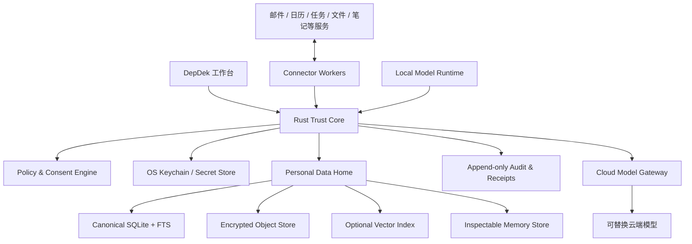

# DepDek 概念设计：个人数据工作台

> 状态：概念基线 v0.1
> 产品名：DepDek
> 核心命题：我的数据我做主（My Data, My Agency）

## 1. 一句话定义

DepDek 是一个 local-first 的个人数据工作台：它把分散在邮件、日历、任务、文件、笔记和其他服务中的个人数据带回本地，归一为用户可理解、可检索、可迁移的数据中心；本地模型负责日常理解与执行，云端模型仅在用户策略允许时处理高价值的规划任务。

DepDek 不是“另一个聊天机器人”，也不是把第三方服务简单拼成入口集合。它的核心资产是用户本地持有的个人数据图谱、可审查的长期记忆、凭据控制权，以及所有外部操作的授权与审计记录。

## 2. 产品愿景

今天的个人数字生活被切割在多个服务中：日程知道用户要去哪里，邮件知道用户与谁协作，文件记录产出，任务系统记录承诺，浏览与收藏记录兴趣，但任何单一服务都无法代表完整的用户。

DepDek 希望建立一个由用户持有的“个人数字底座”：

1. **连接但不依附**：服务是数据源与行动通道，DepDek 是用户的长期主数据层。
2. **本地优先**：原始数据、归一数据、索引、记忆、策略和审计默认留在本机。
3. **模型可替换**：本地或云端模型只是处理器，不是数据所有者。
4. **最小披露**：调用云端模型时，只发送完成任务所需的最小上下文。
5. **可见、可控、可撤销**：同步、推理、外发和写回都能解释、审批、回滚或撤权。
6. **越用越懂，但不偷偷定义用户**：长期记忆必须有来源、置信度、有效期，并允许用户查看、修正和删除。

## 3. 产品承诺

DepDek 对用户作出五项明确承诺：

- 数据默认存本地，可一键导出为开放格式。
- 凭据进入独立安全存储，不写入普通文件，不直接暴露给模型。
- 没有用户策略授权，个人原文不发送到云端模型。
- 每一次数据访问、模型外发和外部服务写操作都有审计凭证。
- 断网时，核心浏览、检索、整理和本地模型能力仍可使用。

## 4. 核心概念模型

### 4.1 Personal Data Home（个人数据家园）

用户选择或创建一个 DepDek Home。它是本地数据主目录，但不等同于当前的“任意文件夹”：

- `objects/`：原始附件、图片、导入文件等内容寻址对象。
- `records/`：开放格式的可迁移记录或导出快照。
- `indexes/`：全文、向量和关系索引，可随时重建。
- `receipts/`：同步、模型外发与外部操作回执。
- `backups/`：可选的加密备份清单。
- SQLite：归一实体、关系、同步游标、任务状态和策略元数据。

凭据不属于 Personal Data Home，必须存入操作系统钥匙串或独立加密 Secret Store；数据库只保存 `credential_ref`。

### 4.2 Connection（连接）

连接代表用户授权 DepDek 访问一个外部服务。每个连接包含：

- 服务类型与账号身份。
- 授权方式、权限范围和过期时间。
- 同步方向：只读、双向或仅行动时写入。
- 数据类型范围与时间范围。
- 同步游标、健康状态和最近结果。
- 凭据引用，而非凭据明文。

### 4.3 Canonical Record（归一记录）

不同来源的数据被映射为统一但可扩展的记录：

- `Person`：联系人、参与者、组织关系。
- `Message`：邮件、聊天消息、通知。
- `Event`：日历事件、时间块、截止日期。
- `Task`：待办、承诺、行动项。
- `Document`：笔记、网页、附件、文件。
- `Project`：目标、主题或持续工作单元。
- `Transaction`：可选的财务记录。
- `Activity`：习惯、学习、健康或系统行为摘要。
- `MemoryFact`：带来源和置信度的长期记忆候选。

所有记录都带 `source_ref`、`source_updated_at`、`local_updated_at`、`sensitivity`、`provenance` 和可选的冲突状态。归一化不能丢失原始来源；用户随时可以回看“这条信息从哪里来”。

### 4.4 Action（行动）

Action 是 DepDek 对本地数据或外部服务执行的结构化操作。行动与对话解耦，至少包含：

- 目标与计划。
- 需要读取的数据范围。
- 使用的模型与外发范围。
- 外部服务写操作及风险等级。
- 审批状态、执行状态、结果和回滚信息。

“发送邮件”“修改日程”“删除文件”“提交表单”属于高风险行动，默认需要逐次确认；本地分类、摘要、打标签属于低风险行动，可按用户策略自动执行。

### 4.5 Memory（长期记忆）

DepDek 的“越来越了解自己”不是把所有历史塞进提示词，而是维护一个可治理的记忆层：

- **事实记忆**：身份、偏好、长期约束。
- **情境记忆**：当前项目、近期优先级、重要关系。
- **程序记忆**：用户偏好的工作方式、审批习惯、输出格式。
- **反思摘要**：从行为中推断出的候选规律，必须可审查。

每条记忆含来源、生成方式、置信度、有效期、敏感级别和使用范围。模型推断默认先进入“待确认记忆”，不能静默成为事实。

## 5. 智能分层

### 5.1 本地模型：默认执行层

适合本地完成：

- 全文/语义检索、去重、分类、打标签。
- 邮件与文档摘要、任务抽取、实体关联。
- 个人问答、日程整理、草稿生成。
- 敏感信息识别、云端上下文裁剪与脱敏。
- 日常自动化的意图识别和工具选择。

### 5.2 云端模型：策略增强层

适合按需调用：

- 多约束的中长期规划。
- 高复杂度推理、方案对比和反事实分析。
- 对质量要求高、但已完成上下文最小化的写作任务。
- 本地模型能力不足时的显式升级。

### 5.3 Model Gateway（模型网关）

任何云端调用必须经过统一网关：

1. 任务分类与必要性判断。
2. 数据范围计算。
3. 敏感字段识别与脱敏。
4. 展示将外发的数据摘要、模型、成本和原因。
5. 根据策略自动放行或请求确认。
6. 记录不可抵赖的外发回执。
7. 将结果落回本地，并标记模型与上下文来源。

用户可以设置“仅本地”“询问后使用云端”“特定任务自动使用云端”三档策略。

## 6. 系统概念架构

### 6.1 信任边界

Rust 核心继续作为唯一信任边界，负责：

- 路径、来源和数据范围校验。
- 凭据句柄解析，但不把秘密返回给模型。
- 连接器网络目的地白名单与权限校验。
- 外部写操作审批。
- 模型上下文外发审批。
- 审计、回执、撤销与速率限制。

Sidecar 从“Agent 运行时”演进为受限 Worker Host。连接器、本地模型适配器和 Agent 都不能直接访问文件系统、钥匙串或任意网络；它们只能调用 Rust 暴露的 capability。

## 7. UX 概念

### 7.1 设计母题

参考图不是要逐像素复制，而是采用其“桌面级个人控制台”组织方式：

- 左侧是稳定的生活/工作领域导航。
- 顶部是时间、问候、全局搜索和快速行动。
- 中央是可编排、可调整尺寸的工作台卡片。
- 卡片展示状态和下一步，不把所有信息都塞进聊天。
- AI 是贯穿每个模块的能力，不是唯一入口。

### 7.2 一级信息架构

| 导航 | 用户问题 | 默认工作台 |
|---|---|---|
| 今天 | 今天最值得关注什么？ | 日程、待办、收件箱摘要、提醒、设备/同步健康 |
| 日历 | 我的时间如何分配？ | 日/周/月视图、时间冲突、时间块建议 |
| 待办 | 我承诺了什么？ | 收集箱、今天、即将到期、等待中 |
| 收件箱 | 哪些消息需要处理？ | 邮件/消息统一收件、行动项与草稿 |
| 知识 | 我知道什么、曾经做过什么？ | 笔记、文档、网页、语义检索 |
| 文件 | 我的本地资产在哪里？ | 文件、图片、附件、来源与版本 |
| 项目 | 每个目标进展如何？ | 项目概览、里程碑、相关记录、下一步 |
| 关系 | 我与谁在协作？ | 联系人、互动历史、承诺与跟进 |
| 自动化 | DepDek 正在替我做什么？ | 规则、队列、失败任务、审批 |
| 连接 | 数据从哪里来、能做什么？ | 服务连接、权限、同步状态、撤权 |
| 记忆 | DepDek 如何理解我？ | 已确认、待确认、过期、来源与纠错 |
| 数据与隐私 | 哪些数据在本地或被外发？ | 存储、备份、审计、云端回执、导出/删除 |
| 设置 | 模型、外观和系统如何配置？ | 本地模型、云端模型、策略、快捷键 |

健康、财务、学习等高敏感领域不作为首发硬编码模块；它们在后续通过 Domain Pack 扩展，并默认启用更严格的本地策略。

### 7.3 顶部全局指令栏

同一个输入框统一支持：

- 搜索：`去年和 Alice 讨论预算的邮件`
- 导航：`打开本周日历`
- 创建：`明天下午三点提醒我续费`
- 操作：`把这三封邮件整理成项目`
- 提问：`我这周还有哪些承诺没完成？`

系统必须在结果中区分“找到的信息”“建议”“准备执行的行动”，避免用户把模型推断误认为事实或已执行结果。

### 7.4 卡片工作台

卡片是领域视图的摘要与操作入口，支持：

- 固定、隐藏、拖拽、调整尺寸。
- 数据源与最后同步时间。
- 空态、离线态、权限失效态、冲突态。
- 直接操作与“交给 DepDek”两种入口。
- 展开为完整领域页面。

“今天”默认布局建议：

1. 今日时间轴（主卡，跨两列）。
2. 今日要完成（任务进度和快速收集）。
3. 需要处理（邮件、审批、同步冲突）。
4. 项目脉搏（风险、等待项、近期里程碑）。
5. 个人数据健康（连接状态、同步延迟、本地模型状态）。
6. DepDek 建议（可解释、可忽略，不强占注意力）。

### 7.5 AI 交互形态

聊天保留，但降级为四种交互之一：

- **Command Bar**：快速搜索、创建和操作。
- **Copilot Drawer**：围绕当前页面持续协作。
- **Action Sheet**：展示计划、数据范围和审批。
- **Deep Work Session**：复杂规划或多 Agent 协作空间。

## 8. 关键用户旅程

### 8.1 首次建立数据家园

创建本地 Home → 选择加密/备份偏好 → 检测本地模型 → 选择首个连接 → 预览将同步的数据与权限 → 完成首次索引 → 进入“今天”。

### 8.2 连接一个服务

选择服务 → 解释读取/写入权限 → OAuth 或安全凭据输入 → 凭据进入钥匙串 → 同步范围与频率 → 首次同步预览 → 用户确认 → 后台同步 → 展示数据来源与健康状态。

### 8.3 从信息到行动

同步邮件 → 本地模型抽取行动项 → 进入待确认收件箱 → 用户确认成为 Task → 关联 Person/Project/Event → 如需写回外部服务，生成 Action Sheet 并请求批准 → 执行 → 保存回执。

### 8.4 云端策略规划

用户提出复杂目标 → 本地模型形成任务结构并判断需要升级 → 网关展示原因、模型、数据摘要和预计成本 → 用户批准 → 发送最小上下文 → 云端返回方案 → 本地模型结合完整私有上下文落地为项目、任务和日程 → 用户最终确认外部写操作。

### 8.5 管理“DepDek 对我的理解”

打开记忆中心 → 查看待确认推断 → 查看每条来源与使用记录 → 确认、修改、设置有效期或删除 → 立即影响后续本地检索与个性化。

## 9. 体验原则

1. **状态优先于对话**：重要信息用视图、卡片和状态呈现。
2. **先预览，后承诺**：同步、外发和外部写操作先展示影响。
3. **来源永远可达**：摘要、任务、记忆都能回到原始记录。
4. **无声自动化只做低风险事**：越接近外部世界，审批越明确。
5. **离线不是错误态**：离线时仍可工作，只把需要联网的动作排队。
6. **不过度人格化**：DepDek 是可靠的个人系统，不假装成为用户本人。
7. **渐进式复杂度**：首屏只回答“现在该做什么”，高级策略藏在连接、自动化和隐私中心。

## 10. 产品边界

DepDek 首期不做：

- 云端托管的个人数据主库。
- 企业级多人权限与团队知识库。
- 自动执行高风险金融、医疗或法律决定。
- 绕过第三方服务授权机制的抓取。
- 无来源、不可编辑的“人格画像”。
- 默认开放 shell、任意文件系统或任意网络给 Agent。

## 11. 北极星

DepDek 的成功不是“用户发了多少条消息”，而是：用户能否在不放弃数据控制权的前提下，更快地找回信息、履行承诺、做出计划，并逐步减少对碎片化应用的认知负担。
