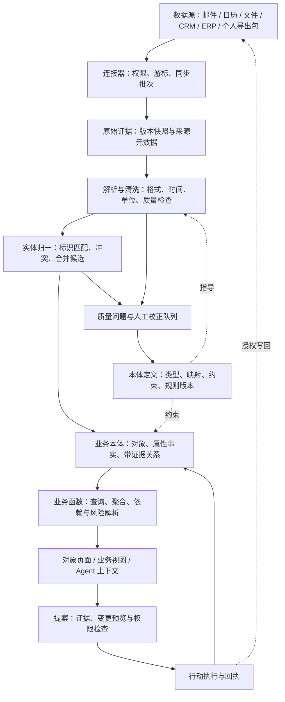
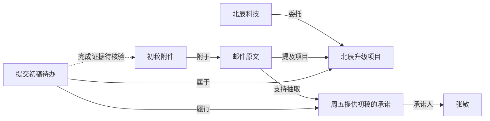

# DepDek 企业与个人工作台：本体、数据治理与业务关联设计

> 日期：2026-09-24
> 状态：架构设计提案，尚未实现；用于下一阶段产品与工程拆分。
> 范围：统一企业与个人的数据语义、接入清洗、实体归一、关联解释和业务行动。
> 接口效力：本文的接口方向不构成已发布协议；三方运行时接口仍以 [contract.md](contract.md) 为唯一标准。

> **产品关系：** DepDek AgentOS 的外壳、设备形态与统一命令体系由 [AgentOS 产品定义](agentos-product-definition.md) 规定；本文定义 AgentOS 所使用的业务本体和数据语义。

## 1. 产品定位与关键决策

**DepDek 应成为企业与个人的业务数据工作台：连接分散数据，将其归一为有证据的业务对象，解析对象之间的关系，并支持用户与 Agent 在授权范围内采取行动。**

个人版与企业版使用相同的本体定义机制和解析引擎，按领域加载不同模型包。企业数据与个人数据分别存储、授权和治理；共享模型定义不意味着共享实际数据。

第一条打通的主线建议是 **人 → 组织 → 项目 → 消息/文档/会议 → 承诺 → 待办 → 执行结果**。它能复用当前邮件、日历、文件、待办和记忆能力，同时适用于个人项目和企业项目。合同、订单、发票、支付作为后续商业领域包加入。

### 1.1 从 Palantir 借鉴什么

Palantir 将本体定义为连接数据与现实业务的操作层，包含对象、属性、关系，以及行动、函数和安全机制。[官方本体概览](https://www.palantir.com/docs/foundry/ontology/overview/)

| 参考概念 | DepDek 的设计 | 业务例子 |
|---|---|---|
| Object Type / Object | 类型定义与业务实例分离 | `Project` 是类型，“北辰升级项目”是对象 |
| Property / Value Type | 有业务定义、类型和校验规则的属性 | 合同金额带币种，截止日期保留时区与精度 |
| Link Type / Link | 声明端点、方向、基数与有效期的关系 | 项目由哪家公司委托、任务由谁负责 |
| Interface | 可复用的能力约束 | `Schedulable` 统一具有开始/结束时间的对象 |
| Function | 带版本、输入范围和结果解释的业务逻辑 | 找出某个项目未兑现的承诺 |
| Action Type | 有参数、前置条件和回执的业务变更 | 确认关联、调整负责人、创建跟进任务 |
| Object Set / Object View | 保存业务筛选与对象工作页面 | “本周到期且缺少完成证据的承诺” |
| Security | 模型管理权限与实际数据权限分别控制 | 能设计客户模型，不代表能读所有客户资料 |

对象、对象集的区别参考 [Object types](https://www.palantir.com/docs/foundry/object-link-types/object-types-overview/)；关系定义参考 [Link types](https://www.palantir.com/docs/foundry/object-link-types/link-types-overview/)；权限分层参考 [Object permissioning](https://www.palantir.com/docs/foundry/object-permissioning/overview/)。下文具体类型、算法、部署方式均为 DepDek 的设计建议，不是对 Palantir 内部实现的描述。

### 1.2 本体如何参与清洗

本体定义“客户是什么、金额采用什么口径、什么才算回款、哪些关系可以成立”；接入与清洗流水线按这些定义执行格式转换、实体匹配、校验和归一。业务专家维护语义，规则和解析器处理数据，模型补充非结构化理解。

Palantir 的公开流程同样包括先连接来源、用流水线清洗和连接数据，再供本体使用；数据质量检查可以阻止错误数据继续传播。[Building pipelines](https://www.palantir.com/docs/foundry/building-pipelines/overview)、[Data expectations](https://www.palantir.com/docs/foundry/maintaining-pipelines/define-data-expectations)

## 2. 与当前项目的衔接

| 当前事实 | 设计衔接 |
|---|---|
| Rust Vault 提供路径沙箱与审计；sidecar 文件操作经 RPC | 本体持久化及对象访问仍受 Rust 信任边界控制 |
| 邮件使用 `mail/<账号>/...md`，包含 Message-ID、References 和附件引用 | 导入为 `Message`、`Document` 和确定性的线程/附件关系 |
| 日历使用 `calendar/events.json`，具有来源账户和远端 ID | 归一为 `CalendarEvent`，保留外部标识与原始时间语义 |
| 待办使用 `todo/queue.json`，有 source、dedupeKey 和泳道状态 | 归一为 `Task`，保留任务来源和状态映射 |
| 共享记忆的事实源为 `mydata/memory/events.jsonl` | `MemoryFact` 先作为只读投影，确认与撤销继续走原记忆接口 |
| Obsidian 当前有外部 Vault 的只读列举与读取模块 | 第一阶段读取笔记并建立文档/引用投影；完整语义图谱属于待建设能力 |
| 2.0 文档已有 Canonical Object、Proposal、Action、Receipt 的规划 | 本设计补齐元模型、实体归一、字段证据、企业边界与落盘方案 |

基线来源：[2.0 Concept](DepDek%202.0%20Concept.md)、[2.0 PRD](DepDek%202.0%20PRD.md)、[现行接口](contract.md)、[记忆设计](agentteam-memory-design.md)、[Obsidian 设计](obsidian-knowledge-graph-design.md)。当前已有能力与规划能力以实际代码及现行契约区分。

## 3. 总体数据架构



各层都有明确产物：

| 层 | 产物 | 关键约束 |
|---|---|---|
| 接入 | Connection、SyncRun、SourceRecord | 来源游标在数据持久化成功后推进；支持重试与删除通知 |
| 原始证据 | SourceRevision、内容快照/引用 | 保留原貌、哈希和来源权限；“来源说了什么”可重现 |
| 清洗 | NormalizedRecord、QualityIssue | 不静默丢弃坏记录；转换和规则版本可追溯 |
| 本体 | Object、Assertion、Relation、Evidence | 相同业务对象跨来源归一；候选与事实分开 |
| 业务解析 | ObjectSet、MetricResult、Insight | 返回口径、路径、时间范围、覆盖率和不确定性 |
| 行动 | Proposal、Action、Receipt | 输入版本检查、幂等、权限与外部执行结果可核对 |

## 4. 本体元模型

### 4.1 模型定义与运行数据

“北辰科技”和“张敏”是运行数据，`Organization` 和 `Person` 是模型定义。两者分别版本化、分别授权。

| 定义 | 最小字段 | 约束 |
|---|---|---|
| `OntologyPackage` | id、namespace、version、dependencies、owner | 核心包 + 个人/企业领域包；发布版本不可原地修改 |
| `ObjectType` | id、properties、interfaces、identity_rules、lifecycle | 类型 ID 不依赖显示名称；业务字段有明确描述 |
| `PropertyType` | key、value_type、required、unit、enum、resolution_policy | 区分可空、未知、未提供、被隐去；禁止把缺失金额填成 0 |
| `LinkType` | id、from_type、to_type、forward_name、reverse_name、cardinality、temporal | 两端类型检查；反向关系是同一条边的视图 |
| `Interface` | id、required_properties、required_links | 首期只定义必要复用约束，后续支持多态查询 |
| `Mapping` | source_schema_version、target_type、field_transforms、identity_rules | 映射可预览、版本化；结构变化不能静默套旧映射 |
| `Rule/Function` | id、version、input_types、logic_ref、output_schema、dependencies | 纯计算与副作用分开；结果记录输入快照 |
| `ActionType` | parameters、preconditions、capabilities、effects、approval_policy | 变更业务对象的统一入口；执行前重新授权 |

通用值类型至少包含 `Money{decimal,currency}`、`Quantity{decimal,unit}`、`Instant{utc,source_timezone}`、`LocalDate`、`DateRange`、`EmailAddress`、`ExternalIdentifier` 和 `ObjectRef`。小数通过十进制字符串或精确十进制表示；汇率转换保留汇率来源与日期。日历全天事件使用日期，不能被强行改成 UTC 午夜事件。

### 4.2 运行对象的通用字段

```text
Object
  id                         稳定内部 ID；不使用姓名、路径或邮箱作为主键
  workspace_id               必填，所属个人/企业工作空间
  type_id / type_version     类型及其版本
  title                      展示字段，仍受读取权限控制
  lifecycle                  active / archived / tombstoned
  revision                   单调递增，用于乐观并发检查
  properties                 当前主体可见的属性投影，不是唯一事实源
  property_states            resolved / unknown / conflict / stale
  source_bindings            多个来源记录与抽取子对象的绑定
  security_labels            密级、用途限制、来源策略引用
  created_at / updated_at    系统时间
```

`Person` 是业务人物，`Principal` 是登录主体，`Agent` 是执行主体，三者不混用。`Task` 是业务待办，现有前端 `TaskRecord` 对应后台运行 `Job`；`CalendarEvent` 是日程，`DomainEvent` 是系统状态变化，避免同名导致语义混乱。

## 5. 企业与个人共享的业务模型

### 5.1 核心包：工作与知识

| 对象 | 关键属性 | 关键关系 |
|---|---|---|
| Person | 姓名、已验证联系标识、别名 | 任职、参与项目、拥有任务、发出承诺 |
| Organization | 法定名称、登记标识、品牌别名 | 任职人员、项目、商业合同 |
| Membership | 角色、部门、起止时间 | 连接 Person 与 Organization；同一人可多次任职 |
| Project | 名称、目标、阶段、计划日期 | 客户组织、参与者、任务、资料、会议 |
| Message | 标题、正文引用、发送时间、线程标识 | 发件人/收件人、附件、讨论对象 |
| Document | 标题、媒体类型、版本、内容引用 | 引用文档、提供证据、描述业务对象 |
| CalendarEvent | 标题、时间、时区、地点 | 参与人、项目、关联行程 |
| Commitment | 承诺内容、期限、状态 | 承诺人、接收方、来源、履行任务 |
| Task | 标题、泳道、优先级、截止时间 | 负责人、项目、依赖、履行的承诺 |
| MemoryFact | 内容、有效期、状态、适用范围 | 指向有证据的属性或关系；遵循原记忆确认机制 |

`Customer`、`Supplier`、`Employee` 首先作为组织或人物在业务上下文中的角色；需要销售阶段、账期、授信等独立生命周期时，再增加 `CustomerAccount` 或 `SupplierAccount`，避免给同一公司制造多个彼此不认识的副本。

### 5.2 领域扩展包

| 领域包 | 对象 | 首要业务问题 |
|---|---|---|
| 企业销售与交付 | Opportunity、CustomerAccount、Contract、Milestone、Deliverable | 客户有哪些商机、交付卡在哪里、哪个承诺到期 |
| 企业交易与费用 | Order、OrderLine、Invoice、InvoiceLine、Transaction、PaymentAllocation、ExpenseClaim | 合同对应哪些订单，支付分配到哪些账单，哪些支出已报销 |
| 个人生活与项目 | Goal、Trip、Booking、Subscription、Asset | 行程资料是否齐全，订阅何时续费，个人目标如何推进 |
| 后续行业包 | Product、Equipment、InventoryItem、Shipment 等 | 按实际行业业务闭环增加，不在第一阶段强行建全行业模型 |

发票是业务对象 `Invoice`，PDF 是 `Document`；付款是 `Transaction`，截图是证据。一个 PDF 可支持多个对象，一个对象也可有多个证据文件。支付与发票可能多对多，通过 `PaymentAllocation` 保存每次分配金额、币种与时间，不能简单把两者合并成一个“交易”。

### 5.3 关系定义

| 关系（正向 / 反向） | 端点及基数 | 解释与规则 |
|---|---|---|
| `member / memberships` | Membership → Person，多对一 | 每段任职有且只有一名人物 |
| `organization / memberships` | Membership → Organization，多对一 | 角色和有效期在 Membership 对象上 |
| `client / commissioned_projects` | Project → Organization，多对一 | 初版每项目最多一个主客户，协作方另建关系 |
| `assigned_to / assigned_tasks` | Task → Person，多对一 | 最多一名主要负责人；协作者采用独立关系 |
| `part_of / tasks` | Task → Project，多对一 | 初版任务最多一个主项目 |
| `depends_on / required_by` | Task → Task，多对多 | 工作依赖禁止形成环；引用关系允许环 |
| `sent_by / sent_messages` | Message → Person，多对一 | 未解析到人物时保留原始地址，不虚构 Person |
| `mentions / mentioned_in` | Message/Document → 业务对象，多对多 | 只表达提及，不能升级为“属于项目”或“合同已生效” |
| `about_project / discussions` | Message/Document/CalendarEvent → Project，多对多 | 必须有业务编号、显式标注或经确认的语义证据 |
| `attached_to / attachments` | Document → Message，多对多 | 由附件元数据确定，保留每次附带的来源实例 |
| `fulfills / fulfilled_by` | Task → Commitment，多对多 | 待办完成可触发复核，不自动证明承诺已兑现 |
| `evidences / evidence_documents` | Document → Contract/Invoice/Deliverable，多对多 | “文档描述/证明对象”，不是对象身份合并 |

角色、金额、起止时间或独立状态很多的关系升级为连接对象，如 `Membership`、`PaymentAllocation`。普通边仍可保存来源、有效期、置信度及确认状态。

## 6. 数据接入与清洗

### 6.1 Connection 与来源版本

每个连接保存 `workspace_id`、provider、来源实例、账号命名空间、`credential_ref`、授权范围、同步模式、对象映射、游标、源 schema 版本、新鲜度目标和连接状态。凭据不进入本体、索引或模型上下文。

持久化标识分三层：

1. `SourceRecord`：来源记录的稳定身份，唯一键为工作空间 + 连接实例 + 来源命名空间 + 远端记录 ID。
2. `SourceRevision`：该记录的某一版本，保存远端版本/内容哈希、采集时间、源修改时间、删除状态与原始数据定位。
3. `SourceBinding`：来源版本中某个实体提及或结构化子记录与本体对象的绑定。一个文件可抽取出多个对象，不能要求一条 SourceRecord 只能绑定一个 Object。

IMAP 的 UID 需与账号、mailbox、UIDVALIDITY 共同构成来源身份；Message-ID 用于消息/线程关联，不能单独替代来源键。日历循环事件需保留 UID 与 RECURRENCE-ID；外部文件优先使用稳定文件标识，路径仅用于定位，哈希只证明内容相同。

### 6.2 标准处理链

| 步骤 | 处理 | 失败/不确定时 |
|---|---|---|
| 1. 接入 | 增量读取、记录批次和源权限 | 重试退避；账号撤权则暂停 |
| 2. 保留原始版本 | 保存原文或授权引用、哈希、时间 | 未持久化成功不推进游标 |
| 3. 解析 | 表格字段、邮件头、ICS、文档文本/OCR | 隔离坏记录，记录解析位置与错误 |
| 4. 格式标准化 | 编码、日期、单位、货币、枚举 | 保留原值；不确定的时区/币种标为待确认 |
| 5. 结构映射 | 来源字段映射到本体属性 | 未识别字段保留于来源层；schema 漂移暂停受影响映射 |
| 6. 实体归一 | 外部键、已验证标识、候选匹配 | 冲突或模糊匹配进入人工队列 |
| 7. 字段消歧 | 按属性权威来源、有效时间、人工纠正选择 | 相互矛盾则保留多条断言和 conflict 状态 |
| 8. 关系解析 | 外键、显式引用、语义候选、领域规则 | 不满足类型/权限/时间条件的关系不得发布 |
| 9. 质量闸门 | 必填、枚举、唯一性、金额/时间/基数约束 | 阻止坏字段/坏关联进入正式投影 |
| 10. 发布 | 事务提交对象、断言、关系与变更事件 | 提交成功后才更新索引进度与同步检查点 |

源记录接收与本体发布使用两个检查点：已经可靠保存原始版本即可提交接入游标；即使解析失败，也能从原始版本重放。发布检查点只前进到已完成的解析批次，避免单条坏数据使整个来源反复抓取。

### 6.3 具体清洗规则

- 时间：保存原文、UTC 时刻、原时区和精度；“本周五”需要消息发送时间及语境时区；“下周交付”不能擅自精确到某个时刻。
- 标识：邮箱只对域名执行通用小写化；本地部分和别名规则依服务商配置。手机号缺少国家信息时不做唯一身份断言。
- 金额：分离含税/未税、币种、正负方向、退款和冲销；缺币种时不进入跨币种汇总。
- 名称：保存原名、规范名和别名；去空格/全半角统一仅用于比较，不能据此合并不同法人。
- 状态：保存 `source_status` 和映射后的标准状态；未知枚举进入 QualityIssue，不能默认改成 completed。
- 去重：同一来源版本重放不得新增对象、候选或重复行动；跨来源同内容只做证据去重，不自动合并业务身份。
- 撤销与删除：来源删除产生 tombstone/撤回事件，重算受影响断言；连接中断只影响新鲜度，不能等同于“远端对象已删除”。

每条 `QualityIssue` 带来源、规则版本、受影响字段/对象、严重度、修复建议和处理状态。原始数据完整、格式合法、身份匹配可靠、业务关系可信是不同指标，不折叠成一个质量分数。

## 7. 业务关联解析引擎

关联解析要分别回答五类问题：**是不是同一个对象、对象之间有什么关系、关系何时成立、这条关系意味着什么、下一步可以做什么。**

### 7.1 实体归一：是不是同一个人/公司/项目

按以下顺序执行，禁止模型直接合并主对象：

1. **范围约束**：先固定 workspace、可访问来源和对象类型；个人与企业空间不能进入同一自动候选池。
2. **既有绑定**：相同来源身份沿用既有对象；更名、邮件地址变更不改变内部 ID。
3. **强标识**：匹配来源系统主键、带登记辖区的法人标识、明确的项目业务编号等。检查标识有效期和冲突，确认键在该业务范围内确实唯一。
4. **候选召回**：姓名、别名、已验证联系标识、组织与时间范围用于缩小候选；向量相似度仅用于召回。
5. **候选评分**：记录具体特征、负证据与评分器版本。模型自报置信度不能视为校准后的正确概率。
6. **决策**：无冲突的确定性规则可建立绑定；模糊候选进入 `MergeProposal`；标识冲突、不同法人或互斥时间证据阻止自动合并。
7. **可撤销合并**：保留旧 ID 的重定向、原 SourceBinding、断言与决策记录；拆分时恢复绑定并重算依赖关系，不能永久抹掉来源差异。

试点阶段只开放确定性自动绑定。后续若使用评分阈值，应按对象类型用人工标注样本校准，并以误合并率控制发布；不能为所有实体统一套用“相似度 > 0.8 自动合并”。共享邮箱、代收电话以及相同名称只作为辅助特征。

### 7.2 关系识别：由强证据到候选

| 机制 | 例子 | 入库结果 |
|---|---|---|
| 结构化外键 | 订单的 customer_id 指向 CRM 客户 | 经类型、范围、源权限检查后形成已验证关系 |
| 原生显式引用 | Message References、文档 WikiLink、项目编码 | 创建 reply_to、references 或对应业务关系；含义不能超出引用本身 |
| 确定性规则 | 已绑定的合同编号出现在订单结构化字段 | 创建 governed_by，并记录规则与字段证据 |
| 语义抽取 | “张敏负责北辰项目，周五提供初稿” | 产生负责人/承诺/项目关系候选，保存原文范围 |
| 图上推导 | 项目依赖的任务延期，影响里程碑 | 产生可重算的 Insight；不冒充源系统的项目状态 |

每种关系单独定义“什么证据足以成立”。一封邮件的收件人不必然是项目负责人；同一文件夹不必然是同一项目；“讨论合同”不代表“签订合同”；没有收到回信不等于对方没有行动。

### 7.3 解析流程

```text
输入：已授权来源版本 + 已发布本体模型 + 当前对象快照
  → 提取实体提及、业务标识、时间表达和显式引用
  → 解析身份；未确定身份的关系保持未解析端点候选
  → 生成关系候选及逐条证据
  → 检查端点类型、基数、有效期、权限、负证据和依赖环
  → 确定性关系提交；语义关系进入 Proposal
  → 更新对象邻接关系与依赖索引
  → 重新计算受影响的业务函数、ObjectSet 和 Insight
输出：对象变化 + 关系状态 + 质量问题 + 可解释业务结果
```

模型只能输出受类型 schema 限制的候选 JSON。来源正文是待分析数据，不能作为授权、工具指令或模型系统指令；读取、网络外发和动作执行权限由 Rust 侧校验。

### 7.4 增量更新与推导失效

`Dependency` 保存 source_revision → assertion/relation → function_result/insight 的依赖。源更正、人工拒绝、对象拆分、本体规则升级、授权撤销均使受影响结果失效。

撤权先在读取路径同步阻断对象、边、摘要、搜索片段及缓存，再异步清理物化索引。数据内容变动可以异步重算，但查询必须返回 `freshness`、`computed_at` 和 `projection_version`；需要最新状态的 Action 必须等待或拒绝过期投影。

关系状态使用 `candidate / confirmed / rejected / superseded / retracted`；另保存有效期与新鲜度。`confirmed` 表示来源规则已验证或人工已确认，不能表示永远真实。证据失效时撤回依赖它的确认；其他独立证据仍有效时重新消歧。

## 8. 属性事实、来源与解释

### 8.1 不把所有来源覆盖成一个值

对象的 `properties` 是属性断言的当前可见投影。每条 `Assertion` 保存：

```text
id, workspace_id, object_id, property_key, typed_value
evidence_ids[], source_revision_id?, rule_version?, model_version?
kind: source_fact | rule_derived | model_inferred | user_asserted
status: candidate | confirmed | rejected | superseded | retracted
valid_from?, valid_to?           业务有效时间，[from, to)
recorded_at, superseded_at?      系统获知/修正时间
confidence?, score_kind?        只有有意义时记录；区分规则/模型/校准评分
decision_ref?, security_labels
```

来源有明确修改时间不意味着那就是业务生效时间。有效期未知时保存 unknown，不把采集时间冒充生效时间。历史查询支持“当时有效的情况”和“系统在那个时刻所知道的情况”。

属性选择政策按字段制定。例如：法定名称优先受信登记来源；项目阶段优先项目管理系统；付款金额来自已核实的交易记录；用户昵称允许用户覆盖。人工纠正带适用来源版本和失效条件；后续源更新触发复核，不永久遮住新信息。多来源与人工编辑需要显式冲突解决，这一原则也可参考 Palantir 的 [How user edits are applied](https://www.palantir.com/docs/foundry/object-edits/how-edits-applied)。具体优先规则为本项目设计。

**“事实”表示可追溯的来源陈述，不保证现实永远正确。** 两封相互矛盾的邮件可以同时成为来源证据，系统应展示冲突，而非选择较新的模型总结掩盖冲突。

### 8.2 Evidence 与关系示例

`Evidence` 统一保存来源版本、定位器和访问策略。定位器可为 JSON Pointer、CSV 行/列、邮件正文字符范围、PDF 页码/区域或笔记块 ID。片段对应固定内容版本，不能用变化后的文件行号解释旧判断；片段缓存继承来源权限。

以下 ID 和内容均为虚构示例，展示一条已确认关系；正式模型还需依据实际来源生成完整审计及版本记录。

```json
{
  "id": "rel_demo_17",
  "workspace_id": "ws_demo_enterprise",
  "link_type": "work.task.assigned_to",
  "link_type_version": 1,
  "from_object_id": "task_demo_42",
  "to_object_id": "person_demo_7",
  "status": "confirmed",
  "origin": "model_inferred",
  "decision_ref": "decision_demo_3",
  "valid_from": "2026-09-14T09:00:00+08:00",
  "valid_to": null,
  "recorded_at": "2026-09-14T09:05:00+08:00",
  "evidence": [
    {
      "source_revision_id": "source_revision_demo_9",
      "locator": {"kind": "text_range", "unit": "unicode_codepoint", "start": 0, "end": 16},
      "excerpt": "张敏负责北辰项目，周五提供初稿。",
      "reason": "句子明确表达负责人，但需要人工确认身份及任务边界。"
    }
  ],
  "security_labels": {"classification": "internal", "policy_refs": ["project_demo_policy"]},
  "revision": 1
}
```

关系仍标记 `origin=model_inferred`，用户确认不会把它改写成源系统外键事实。`decision_ref` 指向确认人、确认时间、确认范围及所见证据版本。字符范围只是本例定位形式，真实导入须对原文核验。

### 8.3 查询与解释结果

每条业务解析结果至少返回：

- `answer/structured_result`：可供页面使用的结构化结论。
- `object_refs` 与 `relation_paths`：涉及哪些对象，沿哪些类型的关系得到结果。
- `evidence_refs`：可点击的来源及原文位置。
- `rule_versions`、`snapshot_revision`、`as_of`：使用哪个口径和数据快照。
- `coverage`、`freshness`、`unknowns`、`conflicts`：哪些数据尚未接入、已过期、缺失或矛盾。
- `suggested_actions`：可预览的提案；查询不直接执行外部动作。

查询计划遵循 **识别业务对象 → 确定业务函数与口径 → 在已授权对象集合中查询/遍历 → 取得证据 → 生成解释**。向量检索可帮助找到文件，但不能独立计算项目归属、未回款金额或事实状态。聚合前先按业务 ID 去重，并处理多对多分配，防止文档数量或连接展开造成重复计数。

## 9. 三个端到端业务场景

### 9.1 企业：项目承诺与交付风险

虚构输入：CRM 记录北辰科技及项目 `BC-2026-017`；邮件写“张敏负责北辰项目，周五提供初稿”；项目会议有同一业务编号；附件文件名为“北辰初稿_v1”。

1. CRM 的客户/项目 ID 创建稳定 Organization、Project 及 client 关系。
2. 邮件项目编号可确定项目归属；若只有“北辰”简称，则先用已确认别名召回并保留候选。
3. 原文抽取 Commitment，人物身份与“周五”的语义经过核验；用户确认后可创建履行它的 Task。
4. 日历会议以项目编号关联；附件建立 attached_to，不能只凭文件名判定“已交付”。
5. 当到期且不存在已确认的履行证据时，`work.open_commitments` 返回“承诺已到期，当前已接入数据未见履行证据”，同时标注最近同步时间。
6. 若业务已确认此承诺是某里程碑的前置条件，再生成对该里程碑的风险提示；不能把“有关联”直接表达为因果。
7. 系统生成跟进草稿提案；发送需满足用户授权策略，执行后保存 Receipt。



预期回答示例：“北辰升级项目有 1 项到期承诺待核验，承诺人为张敏；依据为该邮件的承诺句。附件已收到，但尚未确认满足交付要求。项目系统最后同步于……。”每个可见断言均可展开证据。

### 9.2 企业：订单、发票与付款核对

虚构输入：同一客户有 120,000 CNY 的订单、两张分别 60,000 CNY 的发票，以及 80,000 CNY 已核实到账。付款分配为第一张 60,000、第二张 20,000。

本体路径为 Organization → Order → Invoice；Transaction → PaymentAllocation → Invoice。函数按发票 ID 和有效 PaymentAllocation 汇总，得到第二张未分配覆盖余额 40,000 CNY。

业务语义必须区分：订单额、合同额、已开票额、已到账额、已分配到账额和逾期应收。只有在账单范围完整、币种一致、贷项/退款/冲销已计入且到期日已核实时，才能进一步判断逾期。未分配到账款应单列，不能凭相近金额强行匹配；这是一条业务数据核对示例，不替代企业自己的会计口径。

### 9.3 个人与企业交集：出差与报销

个人邮箱收到机票订单与酒店确认，个人日历有上海行程，企业项目要求参加客户会议。

- 个人空间建立 Trip、Booking、Order、Document，关联出行日期、旅客与订单标识。
- 企业空间已有 Project、CalendarEvent 和 ExpenseClaim。相同人名或会议标题不会触发跨空间自动合并。
- 用户授权共享指定行程字段与票据后，在企业空间生成 `SharedProjection`，仅包含必要日期、金额和票据；私人同行者、私人备注及其他邮件不随之共享。
- 企业报销对象关联本空间的共享投影；个人侧展示“用于哪项报销”的授权回执。两侧保留独立身份和可撤销的共享记录。
- 规则检查会议与交通时间冲突、必要票据是否齐备、是否存在相同票据的重复申报候选，给出证据后由用户决定。

这里的跨空间共享是 DepDek 自行设计的受控投影，并非声称 Palantir 支持跨 Ontology 原生关系；其公开文档说明关系位于同一 Ontology 内。[Link types](https://www.palantir.com/docs/foundry/object-link-types/link-types-overview/)

## 10. 存储设计与事务边界

### 10.1 本地版的存储选择

建议新本体存储采用 **Rust 管理的 SQLite 业务主库 + 原始内容文件 + 可重建搜索索引**。对象关系以节点/边表表达；第一阶段限定查询跳数和对象数，不需要先引入独立图数据库。SQLite 适合应用本地数据容器，但写入会串行化，因此此选择针对单用户桌面端，不代表企业多人服务也共用一个文件。[SQLite 适用场景](https://www.sqlite.org/whentouse.html)、[SQLite 隔离与单写入者](https://www.sqlite.org/isolation.html)

**主库保存唯一的规范化业务状态、断言、人工决策和行动记录，不能当作可随意删除的缓存。** 原始文件不足以恢复人工确认和行动历史，备份必须覆盖业务主库。全文与向量索引可从授权后的主记录重建。既有记忆 JSONL 仍是记忆模块的事实源，本体仅保存其镜像；将来如迁移记忆主存储，需要单独修改契约并停止旧写入。

候选目录（尚未创建）：

```text
<Home>/ontology/
  packages/                         已发布类型、关系、映射与规则定义
  workspaces/<workspace_id>/
    ontology.sqlite                 对象、断言、决策与事务主库
    raw/<connection_id>/<revision>/  不含凭据的原始内容版本
    search.sqlite                   全文派生索引，可重建
    vectors/                        可选语义索引，可重建
    exports/                        显式导出的 JSONL/模型包/清单
```

每个工作空间独立存储；在表键中仍保留 workspace_id，便于导出校验和后续服务化。共享的是只含 schema 的领域包。JSONL 导出是带快照版本的交换格式，不是与 SQLite 同时写入的第二个主库。

### 10.2 逻辑表设计

以下为逻辑模型，不是可直接执行的 SQL migration。各表 ID/FK 必须把 workspace_id 纳入约束，系统级模型包单独管理。

| 表/表组 | 关键列 | 主约束或索引 |
|---|---|---|
| workspaces、principals、memberships | owner、mode、subject、roles、policy_revision | 登录主体与业务 Person 分离 |
| ontology_packages、type_definitions、link_definitions | namespace、type_id、version、definition | 同名模型版本不可变，依赖可解析 |
| connections、sync_runs、checkpoints | source_instance、credential_ref、cursor、status | 一个来源实例与账号命名空间唯一 |
| source_records、source_revisions | source_key、remote_version、hash、observed_at、deleted | 来源键唯一；版本幂等键唯一 |
| normalized_records、quality_issues | revision_id、mapping_version、payload、issue | 解析产物按来源版本与映射版本去重 |
| objects | id、type_id、type_version、revision、lifecycle | 索引 workspace + type + lifecycle |
| source_bindings、identifiers | source_record_id、entity_locator、object_id、scheme、issuer、validity | 绑定包含抽取子对象位置；标识唯一性按 scheme 的业务范围定义 |
| property_assertions、evidence、assertion_evidence | object_id、property_key、typed_value、status、validity | 按对象/字段/业务时间查询；所有事实可回溯 |
| relations、relation_evidence | type_id、from_id、to_id、status、validity | 正向与反向邻接索引；同一来源/规则输出幂等 |
| object_projections、property_selections | object_id、property_key、assertion_id、projection_version | 当前值是可重算投影；权限敏感字段按主体授权后选择 |
| merge_decisions、identity_redirects | from_object_id、to_object_id、binding_snapshot、decision | 支持撤销合并；禁止重定向环 |
| proposals、decisions、actions、receipts | actor、input_revision、policy_revision、status、idempotency_key | 幂等键在工作空间、动作类型、执行主体范围内唯一 |
| domain_events、outbox、dependencies | event_id、aggregate_revision、effect_id、upstream_ref | 事件/待执行副作用与业务变更同事务提交 |
| share_grants、shared_projections | origin_ref、allowed_fields、purpose、expiry、revision | 跨空间数据只经投影，不允许普通外键跨库读取 |
| object_sets、function_runs、insights | filter_ast、definition_version、snapshot、result、dependencies | 保存查询定义与每次结果快照；读取时重新应用权限 |

业务高频字段可建立专用投影表及索引；长尾属性保存带类型校验的 JSON 值。避免只存一个巨大 JSON，也避免把所有日期、金额都降为字符串后全表扫描。FTS5 可以承担全文检索；中文分词或 n-gram 策略需用真实查询样本评估，不能假设默认分词即可满足中文效果。[SQLite FTS5](https://www.sqlite.org/fts5.html)

### 10.3 一致性与恢复

1. 原始文件通过 Vault 写入并校验哈希后，数据库事务建立 SourceRevision 和接入检查点。文件写完、数据库提交前崩溃会产生孤立文件，由对账清理，不能生成指向未完成文件的已发布记录。
2. 一次本体发布在一个数据库事务中提交对象变化、断言、关系、版本、决策、领域事件及 outbox。并发更新检查旧 revision；不匹配返回结构化冲突。
3. 全文/向量索引异步消费事件，记录处理检查点。查询返回索引版本；动作执行使用主库状态重新验证。
4. 远端动作在本地事务提交后由执行器处理。跨本地数据库与远端系统不宣称原子提交；状态机和回执负责收敛。
5. 备份采用一致性数据库快照并包含清单引用的原始版本；不能只复制运行中的数据库主文件而遗漏 WAL 状态。恢复后检查模型版本、引用完整性、权限和 outbox，重建索引；不盲目重放外部动作。
6. 审计文件仍为 `.vault-audit.jsonl`，与业务事件用途不同。每次 Vault 操作无论成功失败均记录。数据库提交与文件审计的跨介质窗口使用 operation_id、持久审计投递状态和恢复对账处理；审计写入故障应阻止新操作并上报，不能把已提交操作谎报为可安全重试的“未发生”。

### 10.4 企业部署边界

企业版目标是同一领域模型由企业服务端统一存储、授权和执行；桌面端持有受控缓存并通过业务 API 访问。多人写入、来源凭据、成员撤权、密级过滤和审计由服务端权威执行，不依赖用户可修改的客户端。

企业主库可采用服务端关系数据库，原始数据用企业对象存储，查询层仍采用同样的 Object/Relation/Action 语义；具体数据库与容量在试点负载明确后选择。不要通过共享网盘让多台桌面直接打开同一个 SQLite 文件。现有 Tauri 本地沙箱不能独立证明企业多租户安全，这属于后续工程建设范围。

## 11. 企业与个人的数据隔离

`Workspace` 是数据与授权边界；企业部门、项目组是权限范围，不必为了每个部门复制一份本体。单个用户可以访问多个空间，但默认查询始终绑定一个明确空间。

| 控制 | 设计 |
|---|---|
| 身份 | Rust/企业服务建立可信 principal 与会话上下文；不得信任请求中自填的角色、workspace 或 session_id |
| 范围 | 对象、属性断言、关系、证据、原文、索引和导出都携带空间与来源策略 |
| 权限 | 角色决定可做的操作，属性/项目/来源策略决定可读的数据；Agent 权限不高于授权人的委托范围 |
| 关联读取 | 可访问起点、终点、关系和必要证据后才返回边；数量、标题、存在性及缓存不能泄漏不可见数据 |
| 派生权限 | 多条证据共同推导的结果继承所需证据权限的交集；独立证据支持的替代结论可按可见证据重算 |
| 共享 | ShareGrant 固定字段、用途、接收空间、有效期；企业管理员不能因此读取个人全部邮箱 |
| 撤回 | 撤权立即阻断在线读取和 Agent 上下文，清理缓存/索引；已经合法导出到外部的副本无法保证远程收回 |
| 行动 | 读取对象、修改业务数据、发送外部消息和授权共享是独立能力 |

初版建议统一密级为 `public / internal / private / restricted`，密级本身不替代来源策略。旧数据的 `personal/private` 保守映射为 private，`sensitive/restricted` 映射为 restricted，未知值默认 restricted；`secret` 和凭据禁止入本体，旧值保留在迁移元数据。记忆 scope 也不能自动变成企业可读范围：旧 `team` 指当前 Agent Team，不等于企业全员。

现有邮件、日历配置仍有明文凭据兼容债务。导入扫描只接受内容目录/业务记录白名单，明确排除 `mail/accounts.json`、`calendar/accounts.json`、Provider 配置、审计文件与系统内部目录；企业模式开放前完成凭据迁移和可信身份绑定。

**授权不能只加在 ontology/query 上。** 通用 vault/read、search、compress、导出以及原始文件预览必须同样应用数据策略；本体数据库、内部索引与权限文件不能经通用 Agent 文件工具读写。否则 Agent 可绕过对象权限或候选确认直接读原文、改主库。路径、资源能力、主体与空间校验统一落在 `vault.rs` 的受控访问层，sidecar 与前端不各自实现一套安全逻辑。

当前 Obsidian 模块独立解析外部只读根；扩展为统一本体接入时，应先把根授权与路径校验归入 Vault 的受控只读资源接口，保留只读行为。这是满足项目集中安全校验约定的迁移前置项，不在新模块复制该例外。

## 12. 业务函数与行动闭环

### 12.1 第一批业务函数

| 函数 | 输入 | 输出与解释 |
|---|---|---|
| `work.project_context` | 项目、时间范围、主体 | 人员、任务、会议、文档、承诺，附关系路径与证据 |
| `work.open_commitments` | 项目/人员、as_of | 已确认且到期未关闭的承诺，附履行证据覆盖与同步时间 |
| `work.task_impact` | 任务、计划快照 | 受影响依赖与里程碑；显式区分依赖分析和预计影响 |
| `finance.invoice_balance` | 账单集合、币种、as_of | 开票额、有效分配、贷项/冲销、余额及无法计算项 |
| `personal.trip_readiness` | 行程 | 交通住宿资料、日程冲突、缺失字段与所需补充 |

`ObjectSet` 保存受限查询 AST，例如“当前用户负责、未来七天到期、状态未完成的 Task”。集合结果始终按当前用户权限重新求值；共享集合定义不能共享集合成员的隐私数据。函数先做确定性计算，再由模型组织自然语言解释。

### 12.2 行动定义

建议首批支持 `ConfirmRelation`、`RejectRelation`、`ResolvePropertyConflict`、`MergeObjects`、`UndoMerge`、`CreateTaskFromCommitment`。外部邮件发送、日历写回和 ERP 更新随后接入同一行动框架。

每个 Action 保存 actor、workspace、type/version、参数、目标对象 revision、证据快照、授权依据、policy_revision、幂等键、预期效果及回执。Action 用于一次受控的业务变更，这与 Palantir 的 Action 将一组对象/属性/关系变更作为事务的思路一致。[Action types](https://www.palantir.com/docs/foundry/action-types/overview)

```text
Proposal: proposed → accepted / rejected / expired / superseded
Action:   pending → running → succeeded / failed / unknown / partial
          unknown → succeeded / failed / partial（经远端核验后）
          succeeded / partial → compensation_pending → compensated / compensation_failed
```

accepted 只表达决策，不代表执行成功。已有用户授权或有效自动化策略可作为执行依据，不为每次低风险处理重复索要批准；外部动作是否需要人工确认由具体授权策略决定。输入版本改变、授权过期或证据撤回时重新评估，必要时产生新提案。

外部超时进入 unknown，先查远端状态；支持幂等键的服务使用同一键重试，不支持幂等且无法查证的发送/提交不得自动重试。补偿是新的行动，保留原 Receipt，不能承诺已发邮件等远端效果可撤销。只有结构化 Receipt 能更新执行结果，模型文字“已经完成”不算成功。

## 13. 模块分工与后续契约工作

本次只交付设计文档，不新增 Tauri command、RPC 方法或运行时类型。下表是后续接口能力清单；实现时先在 [contract.md](contract.md) 定义请求、响应、错误码、授权、分页、事件与迁移版本，再同步 Rust、sidecar、React。

| 层 | 建议新增能力 | 边界 |
|---|---|---|
| Rust Vault | 受控数据库句柄、来源内容访问、空间/主体/策略检查、审计 | 所有安全校验集中在 vault.rs；受管数据库及 WAL/SHM 路径也受保护 |
| Rust ontology store | 模型校验、事务、对象/断言/关系、版本与依赖 | 只能使用 Vault 授予的句柄；不能自行拼路径打开主库 |
| Rust query/action | 有界对象查询、关系解释、提案确认、行动调度 | 校验主体、对象版本、操作能力与返回数据范围 |
| sidecar ingestion | 来源连接、格式解析、映射与规则计算 | 落盘只走 Vault/Rust RPC；协议输出与日志仍分别走 stdout/stderr |
| sidecar intelligence | 提及抽取、语义候选、结论语言表达 | Agent 不获得 fs/bash/直接 SQL；不自行批准模型候选 |
| React | 连接、对象浏览、关系解释、质量修复、决策与回执 | 结构化业务状态由 Rust 提供，不藏在 Chat 或组件状态里 |

待正式设计的接口能力包括：查询类型定义、查询对象集、读取对象及属性证据、限定跳数遍历、解释关系、预览映射、导入批次、提交候选、裁决提案、执行行动、查询回执、创建/撤销共享。

读取请求要有可信会话上下文、workspace、过滤字段白名单、limit/cursor、as_of 和所需新鲜度；响应带 schema_version、snapshot_revision、next_cursor、coverage 与 evidence_refs。建议初始遍历上限 3 跳、单页 100 个对象，并设置总扫描量和执行时间预算；这些是待压测调优的保护参数，不是性能承诺。候选关系默认不参与事实查询，需显式请求且视觉区分。

新协议错误应区分授权失败、版本冲突、模型不兼容、来源失效、质量闸门失败和执行结果未知；错误码在 contract 中分配，不能在本文随意占用。Tauri 参数继续 camelCase，stdio 协议命名与 Rust/sidecar 双方保持一致。

## 14. 工作台呈现

日常工作仍围绕业务对象、待办与决定展开；本体管理入口主要服务数据负责人。建议增加以下可复用页面能力：

| 入口 | 用户主要看到什么 |
|---|---|
| 数据连接 | 接入范围、对象映射、新鲜度、失败原因、重复/冲突记录 |
| 数据模型 | 人/组织/项目等类型定义，关系、规则、字段含义与版本差异 |
| 业务对象 | 关键属性、相关人员、任务、文档、时间线和可执行操作 |
| 关联解释 | “为何关联”、原文证据、确认来源、备选解释和撤销入口 |
| 数据质量 | 重复人物、字段冲突、缺失币种、过期来源及修复预览 |
| 业务视图 | 项目进展、未兑现承诺、出差资料等保存的对象集合 |
| 需要我决定 | 合并、关系确认、冲突解决、共享和行动提案 |

对象详情同时支持列表/时间线/小范围关系图；关系图用于解释某个业务问题，默认不要加载整个空间的所有节点。自然语言提问返回对象卡片与可展开依据，用户离开聊天后仍能在业务页面看到结果。

## 15. 分阶段落地与验收

### 15.1 实施顺序

| 阶段 | 实际交付 | 退出条件 |
|---|---|---|
| A：统一对象基础 | workspace、核心类型、SourceRevision、Assertion、Evidence、Object/Relation 存储；邮件/日历/待办/文档只读映射 | 一个项目跨四类来源可查询；来源回溯完整；重复导入无重复对象 |
| B：业务关联闭环 | Project、Person、Commitment 的关联，候选队列、字段冲突、项目上下文函数 | 用户可确认/撤销关系，从承诺创建待办，看到证据与版本变化 |
| C：企业治理与服务 | 可信身份、来源级权限、Secret Store、企业服务端、受控桌面缓存、共享投影 | 越权查询与通用文件旁路均被阻止；撤权立即生效 |
| D：交易与行业领域包 | 合同/订单/账单/付款分配及选定 CRM/ERP 接入 | 一个真实企业业务问题端到端跑通，口径由业务负责人确认 |
| E：行动与持续优化 | outbox、远端幂等/对账、规则自动化、指标反馈 | 重试不造成重复副作用；失败有可核对回执；规则可按版本回退 |

阶段 A/B 可在个人空间或明确为本地单用户的样例空间验证；在 C 完成前不将本地样例空间标为具备企业多人权限保证。外部行动按当前产品授权边界逐项迁入框架，不因路线表存在就默认开启。

### 15.2 兼容迁移

1. 先记录现有来源的 schema 与稳定标识，新增本体只读投影；邮件/日历/待办/记忆继续由既有模块写入。
2. 将旧 `TodoItem` 映射为 Task、旧日历 Event 映射为 CalendarEvent。状态与 ID 映射存表，遇到未知枚举或不可靠日期进入质量队列，不“纠正”为正常值。
3. 新 Project、Commitment、Assertion、Relation、Decision 由本体主库管理。旧来源变化经适配器同步，本体不能直接双写旧 JSON 与新主库。
4. 试点验证稳定后，若某领域迁移为本体主写，需单独切换单一写入入口，并让旧接口代理至新存储；契约与三层一起迁移。
5. 迁移具有版本、检查点、输入哈希、对象数核对与回滚清单。兼容阶段停用本体可返回原模块；主写切换之后的回滚必须导出并回放新变更，不能丢弃新库退回旧快照。

### 15.3 必须验证的场景

| 场景 | 预期 |
|---|---|
| 同一邮件重取、同一导出包重导 | 原始版本/对象/候选/行动不重复；接入批次可追踪 |
| 两个张敏、同名公司、共享邮箱 | 不因相似名称或共享联系信息误合并 |
| 公司更名、员工转岗、邮箱变更 | 对象 ID 稳定；历史任职和旧标识可追溯 |
| 一份合同 PDF 提到多方及多张订单 | 多对象绑定正确；文档不与合同对象合并 |
| 模型抽取错误后用户拒绝 | 候选不进入事实结果；同版本重放不重新骚扰用户 |
| 两个来源给出不同到期日 | 展示 conflict 与两条证据，后续决策带版本 |
| 来源撤回/更正、对象拆分 | 依赖结论失效并重算；旧解释保留可追溯历史 |
| 源断连且没有付款记录 | 显示资料不完整，不能断言未付款 |
| 分期付款、合并付款、退款/冲销 | PaymentAllocation 核对一致，连接展开不重复计数 |
| 个人/企业间相同姓名与邮箱 | 无自动跨空间合并，未共享字段不出现在搜索或图中 |
| 撤权后的全文、图遍历、缓存、导出 | 同步阻断不可访问内容与存在性泄漏 |
| Agent 直接读主库、原始私密文件或改规则 | Rust 拒绝；成功和失败操作均留审计 |
| 进程中断、并发提交、索引落后 | 主库事务完整、冲突明确、索引可恢复且显示版本 |
| 远端写入成功但响应丢失 | unknown 后查证，不自动重复发送/提交 |
| 本体版本升级与备份恢复 | 明确迁移路径；人工决策、授权与回执不丢失 |

性能测量使用公开的测试配置与合成数据规模，例如 10 万对象、100 万关系；分别记录对象读取、三跳受限查询、全文检索、增量发布与索引延迟的 P50/P95。设计目标可先设单对象读取 P95 < 200ms、常用有界查询 P95 < 1s；需注明机器、数据分布、过滤条件和冷热缓存，未压测前不承诺已达成。

质量指标重点看实体误合并率、关系确认准确率、未知/冲突字段占比、证据覆盖率、来源新鲜度、撤权生效时间、提案采纳及修正率。阈值按试点类型和错误代价设定；发布门优先要求授权隔离、数据完整性和可恢复性，而不是模型生成关系的数量。

## 16. 后续开发的默认选择

- 第一条业务链选择项目协作与承诺管理，优先接入当前已有来源。
- 核心采用可版本化的 Object + Assertion + Relation + Evidence + Action；个人与企业按领域包扩展。
- 先做确定性归一与用户可裁决的候选，再根据标注结果决定是否开放评分驱动的自动绑定。
- 本地端使用 SQLite 业务主库与可重建索引，企业权威数据放在企业服务端；共享模型不共享原始数据。
- 后续实现需先把阶段 A 的模型与接口纳入 contract，再同步 Rust、sidecar、React；本次设计不意味着已接通 CRM/ERP 或具备企业生产权限体系。
